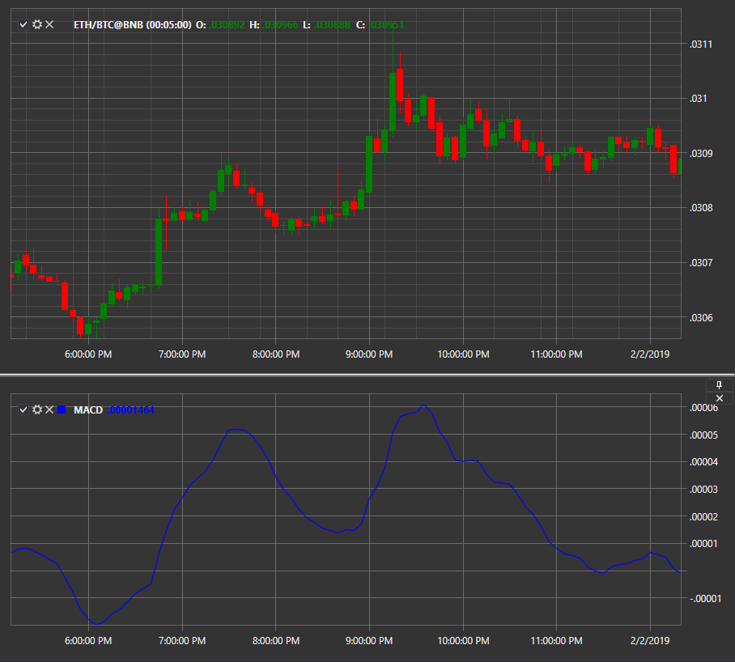

# MACD

**Схождения\-расхождения скользящих средних (Moving Averages Convergence\-Divergence, MACD)** \- индикатор импульса, который показывает взаимосвязь между двумя скользящими средними цены ценной бумаги. 

Индикатор рассчитывается как разность между короткой скользящей средней и длинной скользящей средней. По умолчанию периоды средних соответственно равны 12 и 26. 

Для использования индикатора необходимо использовать класс [MovingAverageConvergenceDivergence](xref:StockSharp.Algo.Indicators.MovingAverageConvergenceDivergence). 

## См. также

[MACD гистограмма](IndicatorMovingAverageConvergenceDivergenceHistogram.md)
