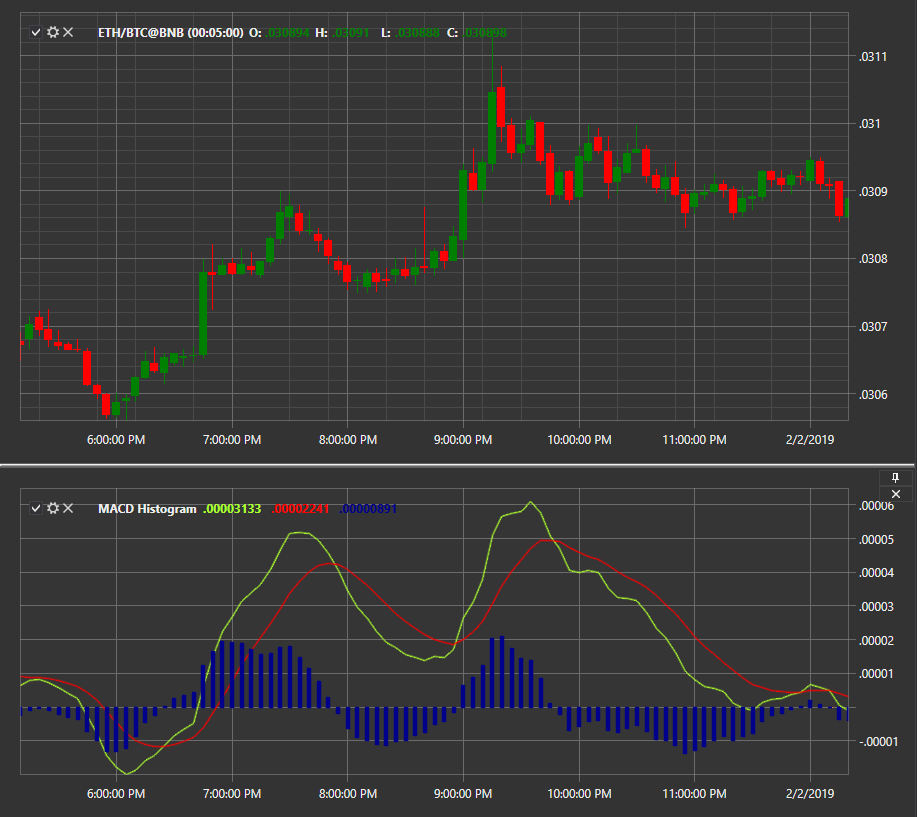

# MACD гистограмма

**Схождения\-расхождения скользящих средних (Moving Averages Convergence\-Divergence, MACD)** \- индикатор импульса, который показывает взаимосвязь между двумя скользящими средними цены ценной бумаги. Представлен в виде гистограммы. 

Для использования индикатора необходимо использовать класс [MovingAverageConvergenceDivergenceHistogram](../api/StockSharp.Algo.Indicators.MovingAverageConvergenceDivergenceHistogram.html). 

## См. также

[MACD с сигнальной линией](IndicatorMovingAverageConvergenceDivergenceSignal.md)
