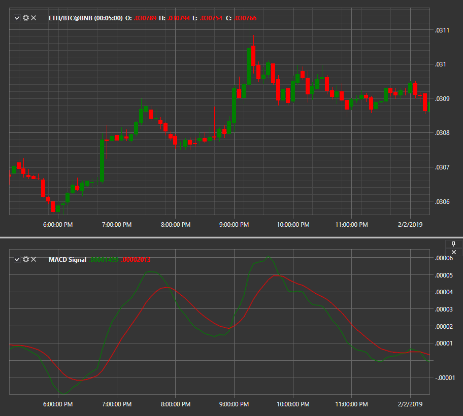

# MACD с сигнальной линией

**Схождения\-расхождения скользящих средних (Moving Averages Convergence\-Divergence, MACD)** \- индикатор импульса, который показывает взаимосвязь между двумя скользящими средними цены ценной бумаги. Представлен с сигнальной линией. 

Для использования индикатора необходимо использовать класс [MovingAverageConvergenceDivergenceSignal](../api/StockSharp.Algo.Indicators.MovingAverageConvergenceDivergenceSignal.html). 

## См. также

[NRTR](IndicatorNickRypockTrailingReverse.md)
