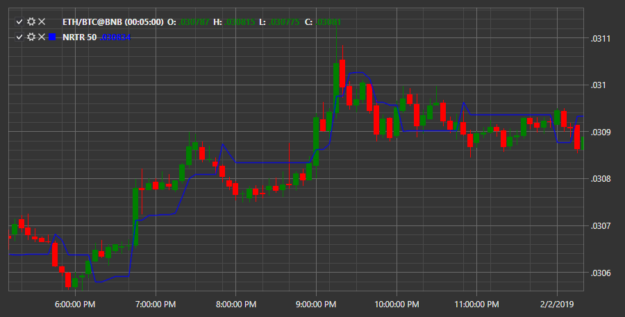

# NRTR

**Nick Rypock Trailing reverse (NRTR)** – суть индикатора заключается в том, что он всегда находится на отрезке от достигнутых экстремумов цены. Здесь была реализована следующая идея: небольшие коррекционные движения против основного тренда должны игнорироваться, а движение против основной тенденции, превышающей некоторый уровень, сигнализирует об обратной тенденции. 

Для использования индикатора необходимо использовать класс [NickRypockTrailingReverse](../api/StockSharp.Algo.Indicators.NickRypockTrailingReverse.html). 

## См. также

[Parabolic SAR](IndicatorParabolicSar.md)
