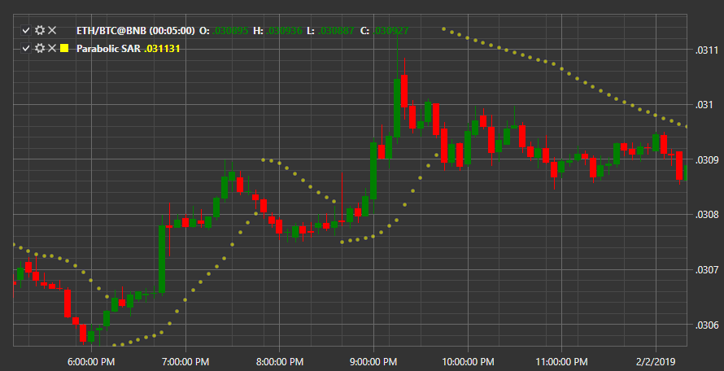

# Parabolic SAR

**Parabolic SAR (SAR)** \- Трендовый индикатор, который указывает точки остановки и разворота цены, а также направление тренда. 

Для использования индикатора необходимо использовать класс [ParabolicSar](../api/StockSharp.Algo.Indicators.ParabolicSar.html). 

## См. также

[Peak](IndicatorPeak.md)
