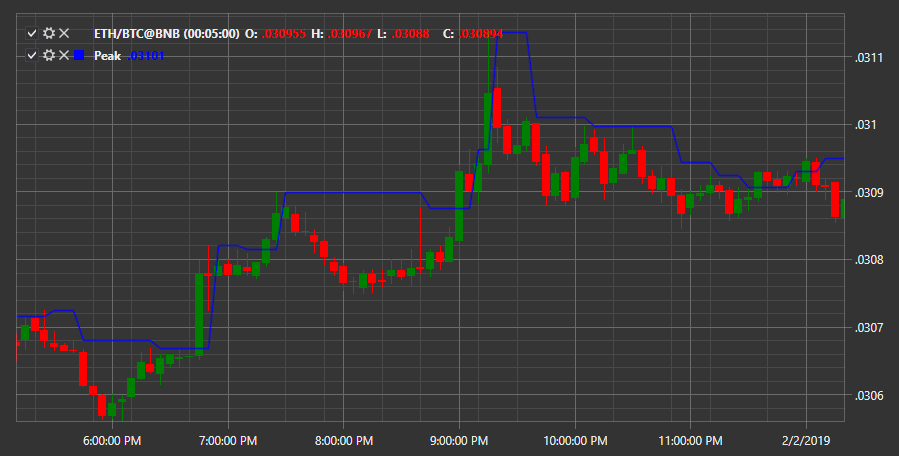

# Peak

Индикатор **Пик** показывает пиковое значение за период. 

Для использования индикатора необходимо использовать класс [Peak](xref:StockSharp.Algo.Indicators.Peak). 

## См. также

[QStick](IndicatorQStick.md)
