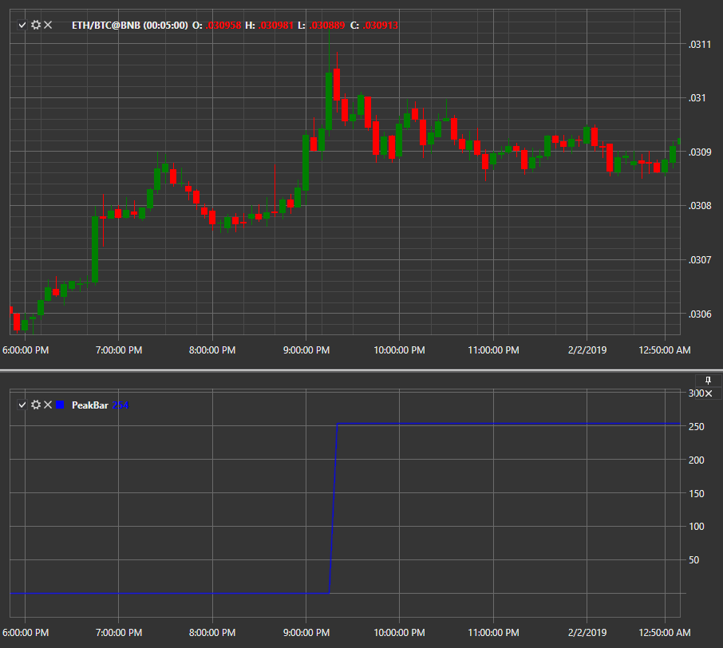

# PeakBar

Индикатор **PeakBar** возвращает пиковое значение цены; основным параметром определения нового пика является процент снижения. 

Для использования индикатора необходимо использовать класс [PeakBar](xref:StockSharp.Algo.Indicators.PeakBar). 

## См. также

[TRIX](IndicatorTrix.md)
