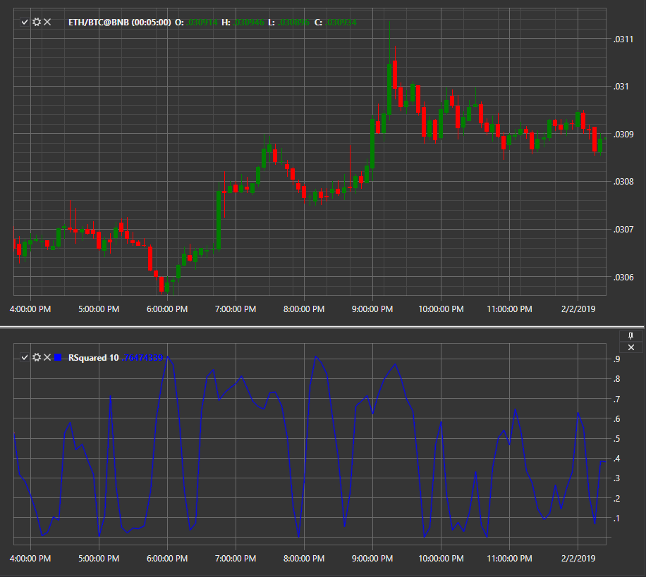

# Linear Regression R\-Squared

**R\-квадрат в линейной регрессии (Linear Regression R\-Squared)** \- индикатор показывает процент изменения цены инструмента, который может быть объяснено с помощью линейной регрессии. Остальные значения вызваны случайными факторами. 

Для использования индикатора необходимо использовать класс [RSquared](../api/StockSharp.Algo.Indicators.RSquared.html). 

## См. также

[SMA](IndicatorSimpleMovingAverage.md)
