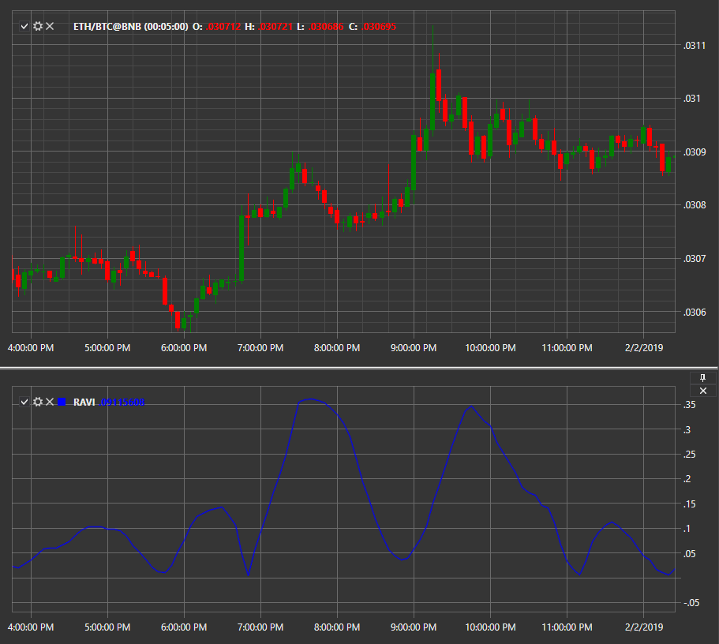

# RAVI

**Range Action Verification Index (Ravi)** — индикатор технического анализа, определяющий наличие на рынке тренда и его направление, и основанный на паре простых скользящих средних с настраиваемыми периодами. 

Для использования индикатора необходимо использовать класс [RangeActionVerificationIndex](xref:StockSharp.Algo.Indicators.RangeActionVerificationIndex). 

## См. также

[RoC](IndicatorRateOfChange.md)
