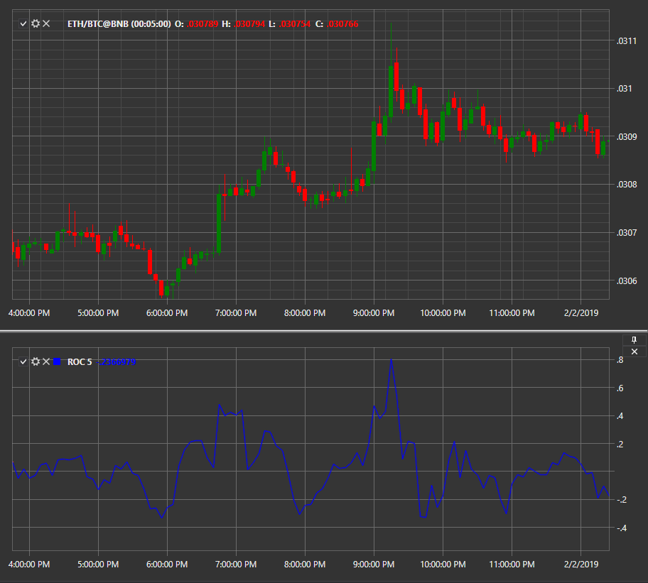

# RoC

**Скорость изменения (Rate of Change, RoC)** индикатор показывает разницу между текущей ценой и ценой за n свечей назад. 

Для использования индикатора необходимо использовать класс [RateOfChange](../api/StockSharp.Algo.Indicators.RateOfChange.html). 

## См. также

[RSI](IndicatorRelativeStrengthIndex.md)
