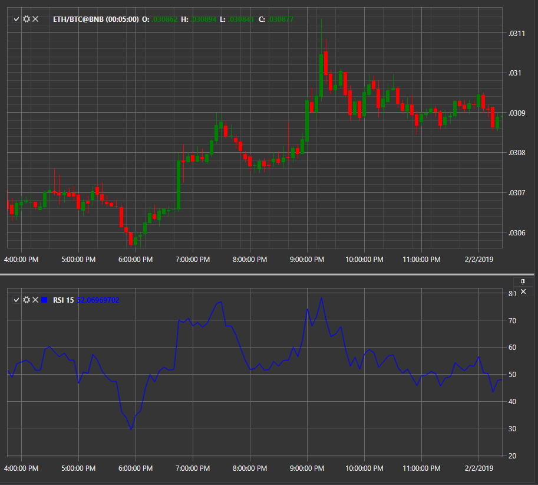

# RSI

**Индекс относительной силы (Relative Strength Index, RSI)** — является индикатором импульса, который измеряет величину недавних изменений цен для оценки условий перекупленности или перепроданности цены акции или другого актива. 

Для использования индикатора необходимо использовать класс [RelativeStrengthIndex](../api/StockSharp.Algo.Indicators.RelativeStrengthIndex.html). 

## См. также

[RVI](IndicatorRelativeVigorIndex.md)
