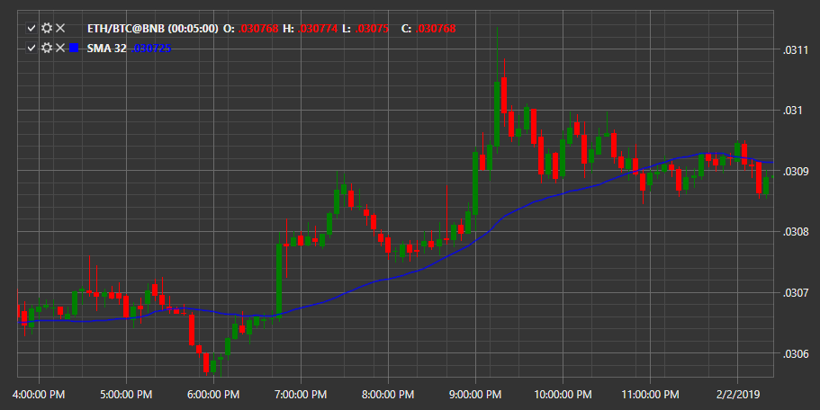

# SMA

**Простая скользящая средняя (Simple Moving Average, SMA)** \- это арифметическое скользящее среднее, рассчитываемое путем добавления последних цен закрытия и деления этого числа на количество периодов времени. 

Для использования индикатора необходимо использовать класс [SimpleMovingAverage](../api/StockSharp.Algo.Indicators.SimpleMovingAverage.html). 

## См. также

[Smoothed MA](IndicatorSmoothedMovingAverage.md)
