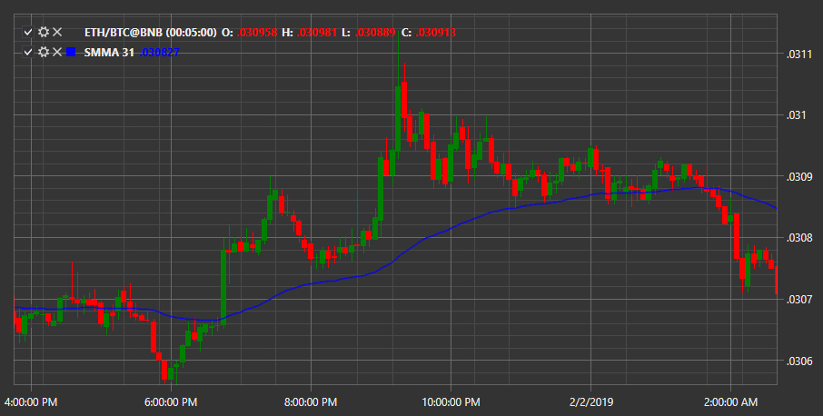

# Smoothed MA

**Сглаженная скользящая средняя (Smoothed Moving Average, SMA)**\- индикатор отображает сглаженное среднее направление цены за определённый временной промежуток. 

Для использования индикатора необходимо использовать класс [SmoothedMovingAverage](xref:StockSharp.Algo.Indicators.SmoothedMovingAverage). 

## См. также

[Standard Deviation](IndicatorStandardDeviation.md)
