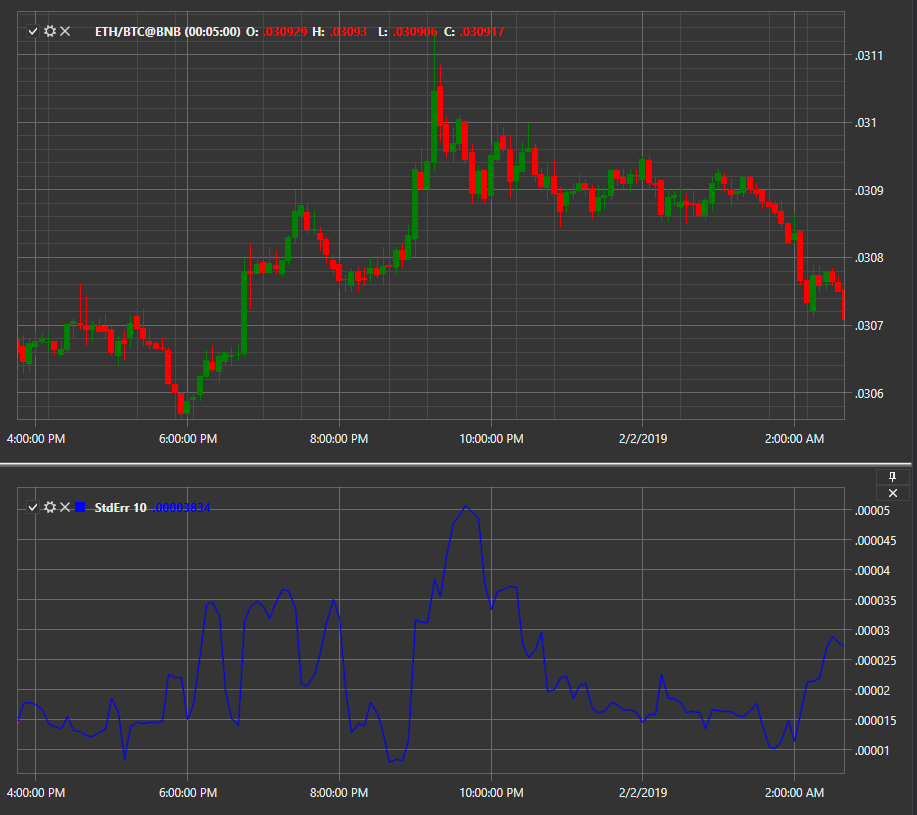

# Standard Error

Индикатор **Стандартная ошибка (Standard Error)** является оценкой среднего квадратичного отклонения коэффициента регрессии от его истинного значения.

Для использования индикатора необходимо использовать класс [StandardError](xref:StockSharp.Algo.Indicators.StandardError). 

## См. также

[Alligator](IndicatorAlligator.md)
