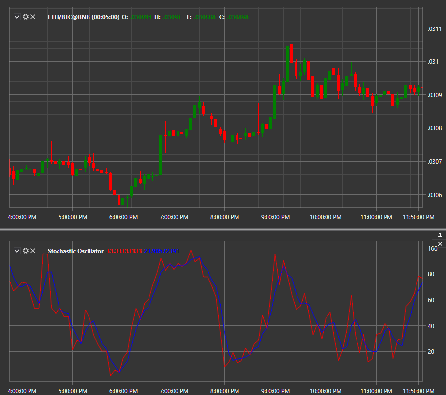

# Stochastic Oscillator

**Стохастический осциллятор (Stochastic Oscillator)** – индикатор импульса, сравнивающий конкретную цену закрытия ценной бумаги с диапазоном ее цен за определенный период времени. Чувствительность осциллятора к рыночным движениям можно уменьшить, отрегулировав этот период времени или взяв скользящее среднее от результата. 

Для использования индикатора необходимо использовать класс [StochasticOscillator](../api/StockSharp.Algo.Indicators.StochasticOscillator.html). 

## См. также

[Sum N](IndicatorSum.md)
