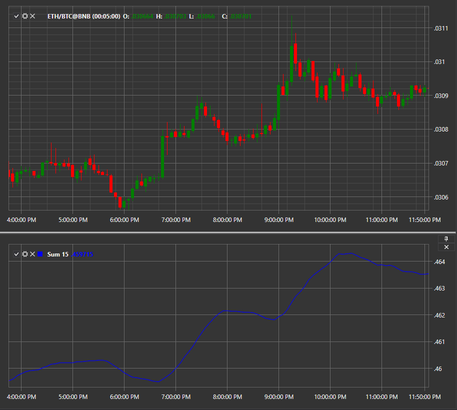

# Sum N

Индикатор **Сумма N последних значений** показывает сумму N последних значений за период. 

Для использования индикатора необходимо использовать класс [Sum](../api/StockSharp.Algo.Indicators.Sum.html). 

## См. также

[TEMA](IndicatorTripleExponentialMovingAverage.md)
