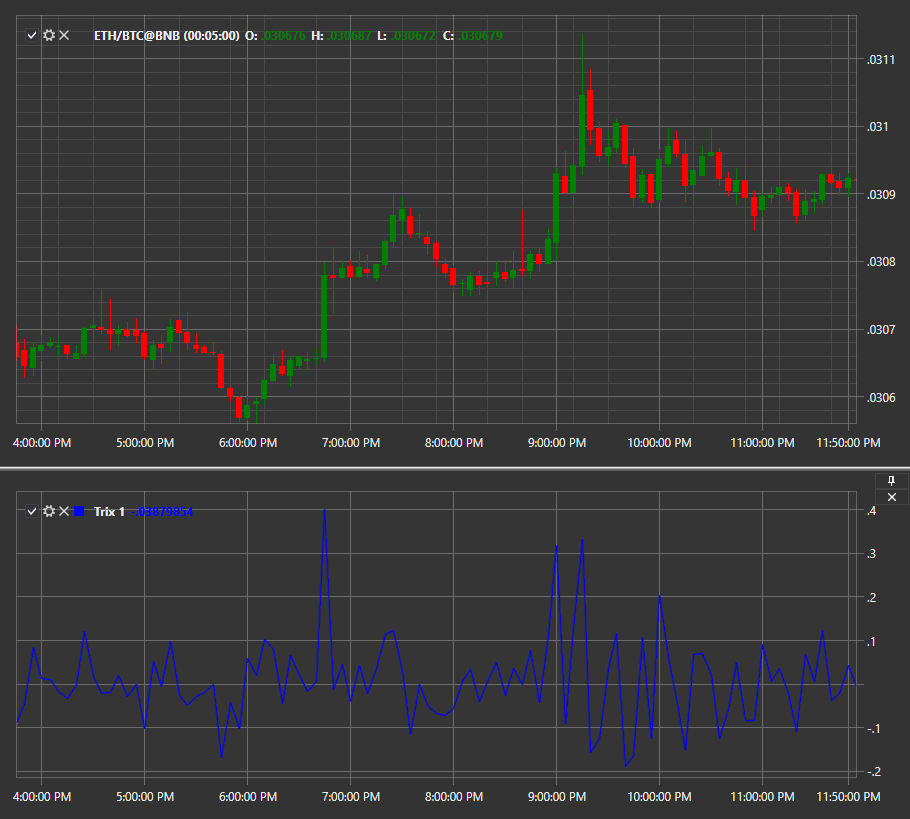

# TRIX

**TRIX** – представляет собой осциллятор, используемый для определения рынков перепроданности и перекупленности или как индикатор импульса. Как и многие осцилляторы, TRIX колеблется вокруг нулевой линии. Когда он используется в качестве осциллятора, положительное значение указывает на рынок перекупленности, а отрицательное значение указывает на рынок перепроданности. Когда TRIX используется в качестве индикатора импульса, положительное значение указывает на увеличение импульса, а отрицательное значение указывает на уменьшение импульса. 

Для использования индикатора необходимо использовать класс [Trix](xref:StockSharp.Algo.Indicators.Trix). 

## См. также

[Trough](IndicatorTrough.md)
