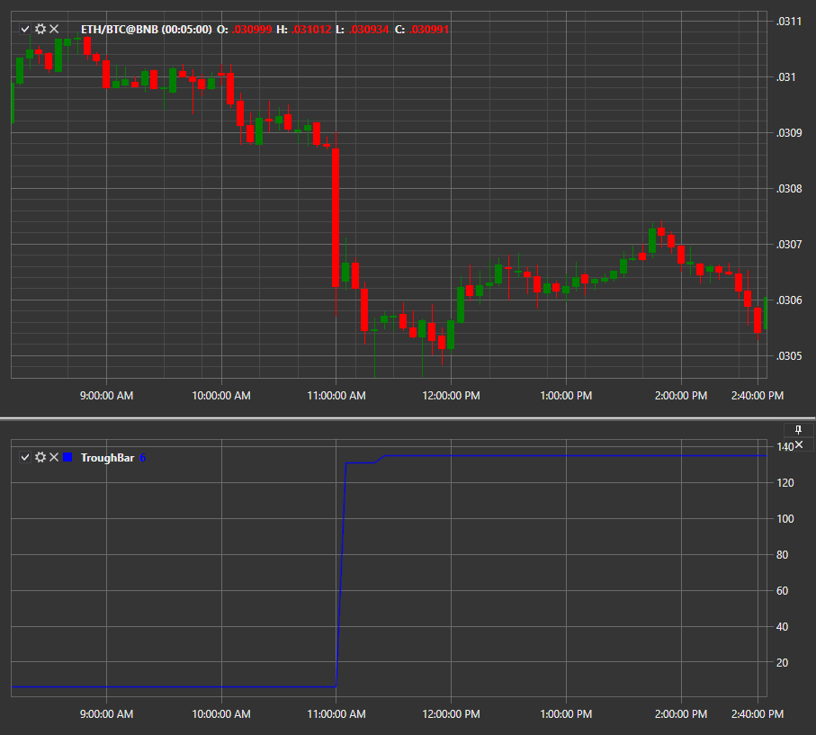

# TroughBar

Индикатор **TroughBar** возвращает минимальное значение цены, основным параметром определения нового минимума является процент снижения. 

Для использования индикатора необходимо использовать класс [TroughBar](../api/StockSharp.Algo.Indicators.TroughBar.html). 

## См. также

[TRIX](IndicatorTrix.md)
