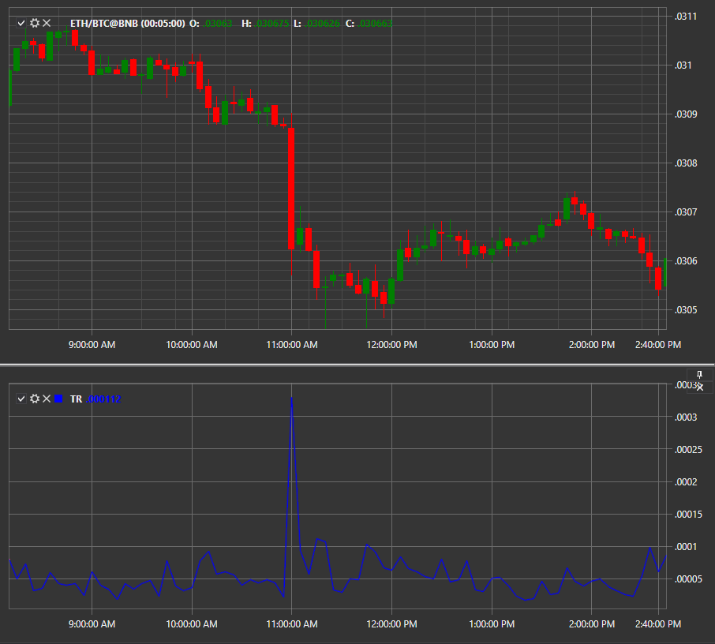

# True Range

**Истинный диапазон (True Range, TR)** показывает текущую рыночную волатильность, определяя диапазон колебаний максимальных, минимальных цен и цен закрытия. 

Для использования индикатора необходимо использовать класс [TrueRange](xref:StockSharp.Algo.Indicators.TrueRange). 

## См. также

[UO](IndicatorUltimateOscillator.md)
