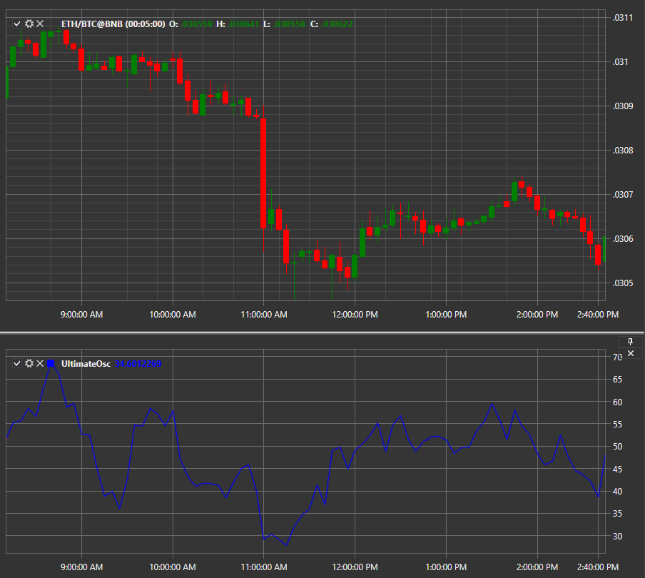

# UO

**Окончательный осциллятор (Ultimate Oscillator, UO)** это технический индикатор, разработанный Ларри Уильямсом в 1976 году для измерения импульса на нескольких таймфреймах. Используя средневзвешенное значение для трех разных таймфреймов, индикатор имеет меньшую волатильность и меньше торговых сигналов по сравнению с другими индикаторами, которые полагаются на один таймфрейм. 

Для использования индикатора необходимо использовать класс [UltimateOscillator](../api/StockSharp.Algo.Indicators.UltimateOscillator.html). 

## См. также

[VHF](IndicatorVerticalHorizontalFilter.md)
