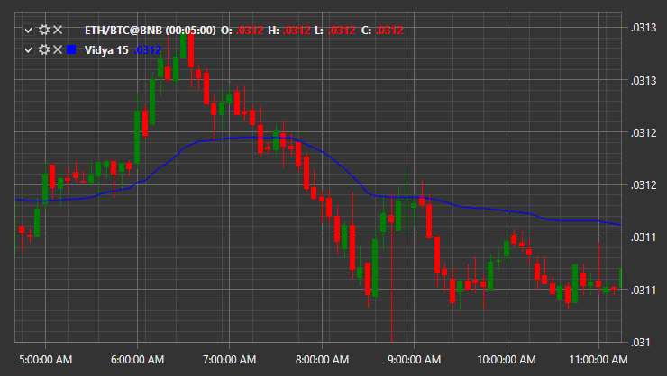

# VIDYA

**Скользящая Средняя с Динамическим Периодом Усреднения (Variable Index Dynamic Average, VIDYA)** \- индикатор с оригинальным методом расчета экспоненциальной скользящей средней (EMA) и с динамически изменяющимся периодом усреднения. Период усреднения зависит от волатильности рынка; в качестве меры волатильности был выбран генератор колебаний импульса (CMO). 

Для использования индикатора необходимо использовать класс [Vidya](xref:StockSharp.Algo.Indicators.Vidya). 

## См. также

[JMA](IndicatorJurikMovingAverage.md)
