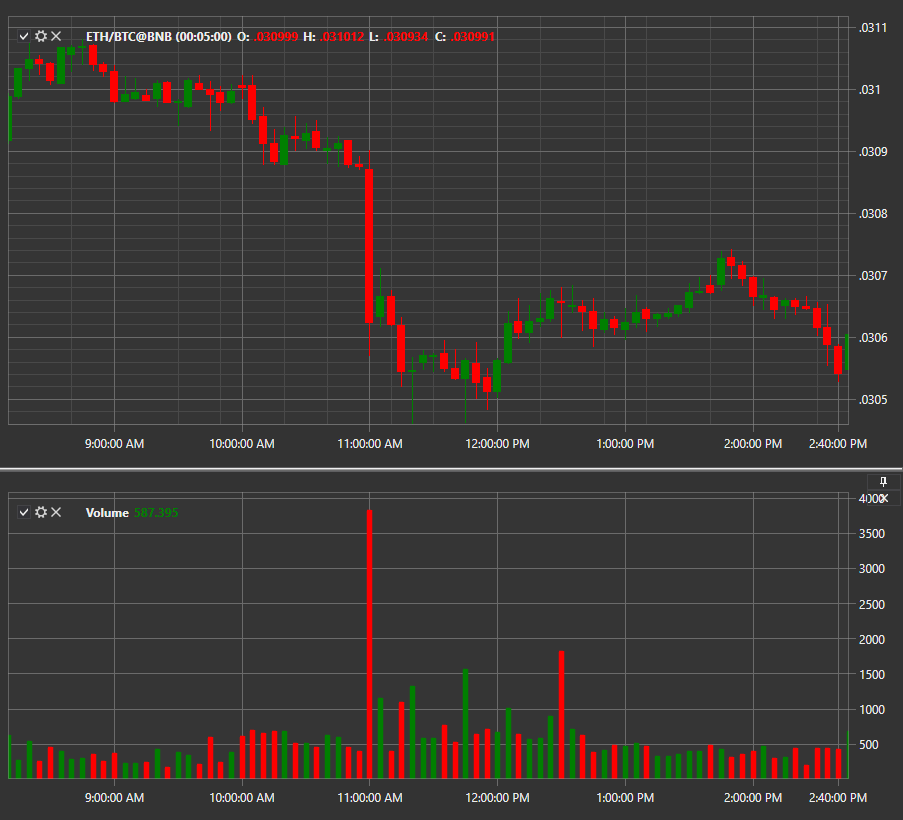

# Volume

Индикатор **Объем свечи**показывает Объем свечи. 

Для использования индикатора необходимо использовать класс [VolumeIndicator](xref:StockSharp.Algo.Indicators.VolumeIndicator). 

## См. также

[Volume Profile](IndicatorVolumeProfileIndicator.md)
