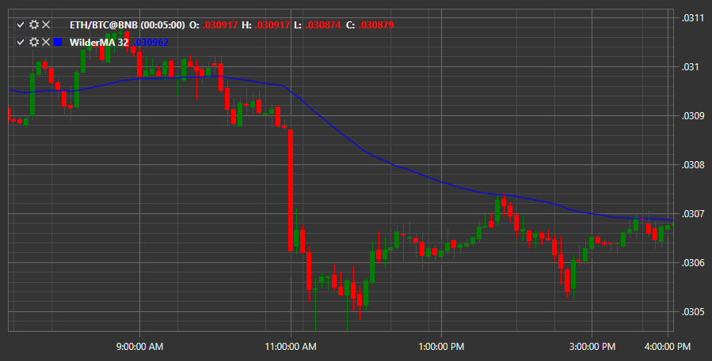

# Wilder MA

**Скользящее среднее Уайлдера(WilderMA)** \- это взвешенный индикатор скользящего среднего. Как и все остальные индикаторы скользящей средней, индикатор WMA сглаживает рыночные шумы и более четко отображает тенденции рынка. Для достижения цели индикатор отфильтровывает рыночные колебания (шумы), усредняя значения цен периодов, по которым он рассчитывается. При этом к средним ценам добавляется некоторая дополнительная ценность (вес), как это делается при расчете всех взвешенных индикаторов, таких как EMA, LWMA и SMMA.

Для использования индикатора необходимо использовать класс [WilderMovingAverage](../api/StockSharp.Algo.Indicators.WilderMovingAverage.html). 

## См. также

[Alligator](IndicatorAlligator.md)
