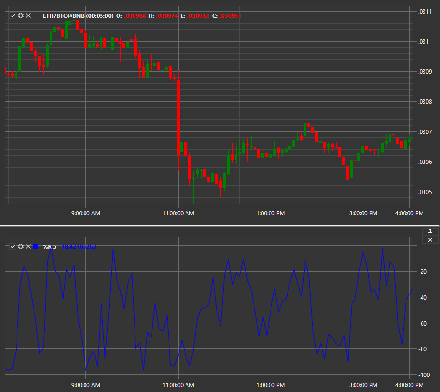

# %R

**Williams %R (%R, Процентный диапазон Уильямса, Процент Вильямса)** — представляет собой индикатор импульса, который изменяется в пределах между 0 и \-100 и отображает уровни перекупленности и перепроданности.

Для использования индикатора необходимо использовать класс [WilliamsR](xref:StockSharp.Algo.Indicators.WilliamsR). 
##### Расчет  
  
Формула расчета индикатора Williams’ Percent Range схожа с формулой для расчета Stochastic Oscillator:  

%R = - (MAX (HIGH (i \- n)) \- CLOSE (i)) \/ (MAX (HIGH (i \- n)) \- MIN (LOW (i \- n))) * 100  
  
где:  
  
CLOSE (i) \- сегодняшняя цена закрытия;  
MAX (HIGH (i \- n)) \- наибольший максимум за n предыдущих периодов;  
MIN (LOW (i \- n)) \- наименьший минимум за n предыдущих периодов.  

В качестве параметра индикатора задается значение n.

## См. также

[ZigZag](IndicatorZigZag.md)
