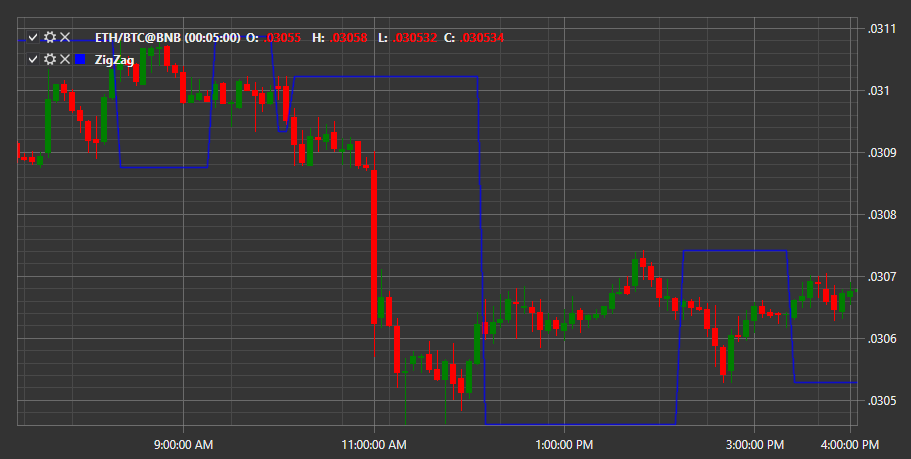

# ZigZag

**ZigZag (ЗигЗаг)** – индикатор отображает точки на графике всякий раз, когда цены меняются на процент, превышающий предварительно заданное значение. Затем рисуются прямые линии, соединяющие эти точки. Индикатор используется для определения ценовых трендов. 

Для использования индикатора необходимо использовать класс [ZigZag](../api/StockSharp.Algo.Indicators.ZigZag.html). 

## См. также

[ZigZag (Metastock)](IndicatorZigZagEquis.md)
