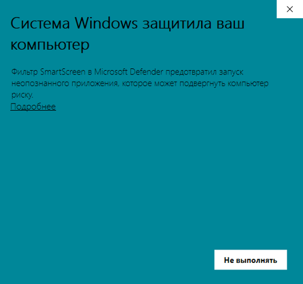
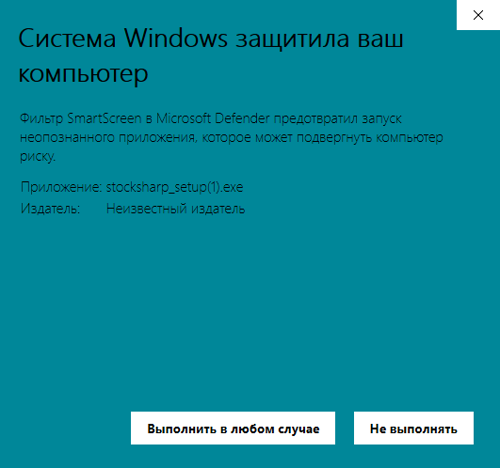

# Первый запуск

1. Для установки [Installer](SharpInstaller.md) необходимо перейти на страницу [Скачать](https://stocksharp.ru/products/download/):
   
   

2. Скачать дистрибутив [Installer](SharpInstaller.md).
3. Запустите установочный файл **stocksharp_setup.exe** и следуйте инструкциям установщика.
4. Иногда Windows не запускает установку сразу, а выдает предупреждение:

   

5.  В этом случае нажмите на сслыку **Подробнее** в окне предупреждения, после чего появится следующее окно:

    

    Нажав на кнопку **Выполнить в любом случае**, вы запустите установку [Installer](SharpInstaller.md)

6. Запустится распаковка [Installer](SharpInstaller.md). Необходимо дождаться полной распаковки.
7.  При первой установке необходимо ввести логин и пароль **StockSharp**.

    

    Вход можно осуществить как через прямой ввод логина и пароля, так и через авторизацию по соцсети (в случае регистрации на сайте StockSharp таким способом пароля не будет).

8. После входа откроется окно программы.

**Смотреть [видеоинструкцию](InstallerSetup.md)**

## См. также

[Установка и удаление программ ](Installer_installing_removing_programs.md)
