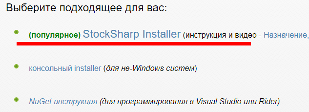
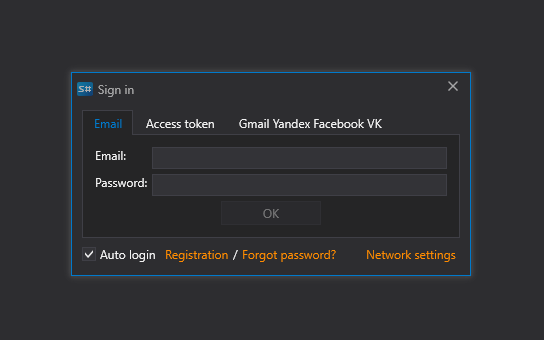
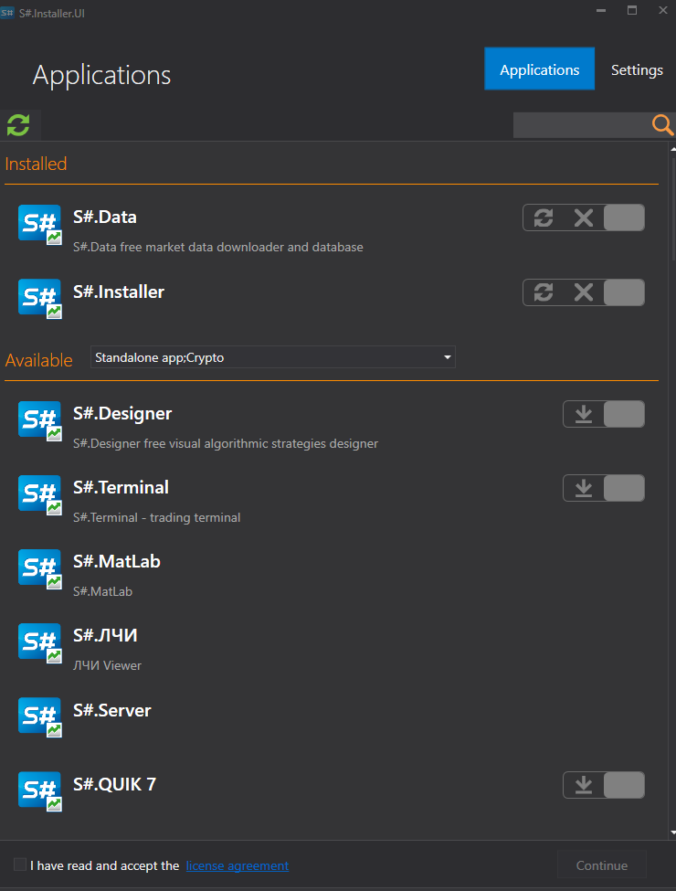

# Первый запуск

1. Для установки [S\#.Installer](SharpInstaller.md) необходимо перейти на страницу [Скачать](https://stocksharp.ru/products/download/):
2. Скачать дистрибутив [S\#.Installer](SharpInstaller.md).
3. Разблокировать (правая кнопка мышки на файле, свойства) **Installer.zip**.
4. Распаковать архив и, в папке с распакованным архивом, найти файл **StockSharp.Installer.Console.bat**.

   Запустить его.
5. Запустится режим установки. Необходимо дождаться полной установки. При первой установке необходимо ввести логин и пароль **StockSharp**.
6. После установки откроется окно программы.

**Смотреть [видеоинструкцию](InstallerSetup.md)**

## См. также

[Установка и удаление программ ](Installer_installing_removing_programs.md)
