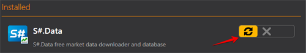

# Установка и удаление программ 

Для удобства поиска необходимого продукта в программе [Installer](SharpInstaller.md) имеется возможность выбора типа приложений.

Для установки нужного приложения необходимо:

1. Выбрать приложение, нажать **Установить**, согласится с лицензионным соглашением и нажать на **Продолжить**.
2. После этого необходимо выбрать путь установки.

   **ВАЖНО\!** Необходимо чтобы папка в которую будет устанавливаться программа была пустой.

   Нажимаем **Продолжить**.
3. Выбираем **Выполнить** и ждем окончания установки.

После окончания установки программа готова к использованию.

Для удаления программы необходимо выбрать **Удалить** и нажать на кнопку **Продолжить**.

Для восстановления необходимо выбрать **Восстановить** и нажать **Продолжить**.

**Смотреть [видеоинструкцию](InstallerSetupPrograms.md)**

## См. также

[Обновление программ](Installer_software_update.md)
