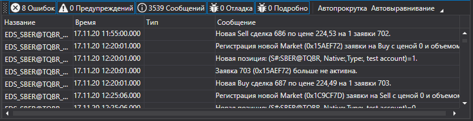

# Визуальный мониторинг

Для упрощения мониторинга работы можно использовать специальную компоненту [Monitor](xref:StockSharp.Xaml.Monitor). См. также [Визуальные компоненты логирования](GuiLogging.md). 



Данное окно позволяет выводить сообщения от всех [ILogSource](xref:StockSharp.Logging.ILogSource): 

- стратегий ([Strategy](xref:StockSharp.Algo.Strategies.Strategy));
- подключений ([IConnector](xref:StockSharp.BusinessEntities.IConnector));
- собственных реализаций [ILogSource](xref:StockSharp.Logging.ILogSource) (например, главное окно в роботе).

В виде дерева показывается вложенность источников. Каждая родительская вершина содержит сообщения всех вложенных и так далее, до самого нижнего уровня. Для стратегий такая иерархия позволяет увидеть [дочерние стратегии](StrategyChilds.md). Для подключений это также полезно в случае использования [множественных подключений](API_Connectors.md). Аналогично, такую же вложенность можно организовать и для собственного робота, реализовав свойство [ILogSource.Parent](xref:StockSharp.Logging.ILogSource.Parent). 

## Использование MonitorWindow

1. Вначале необходимо создать окно:

   ```cs
   var monitor = new MonitorWindow();
   monitor.Show();
   ```
2. Далее, созданное окно необходимо через [GuiLogListener](xref:StockSharp.Xaml.GuiLogListener) добавить в свой [LogManager](xref:StockSharp.Logging.LogManager):

   ```cs
   _logManager.Listeners.Add(new GuiLogListener(monitor));
   ```
3. После этого все источники [LogManager.Sources](xref:StockSharp.Logging.LogManager.Sources) (стратегии, подключения и т.д.), будут посылать сообщения в [MonitorWindow](xref:StockSharp.Xaml.MonitorWindow).

## См. также

[Визуальные компоненты логирования](GuiLogging.md)
