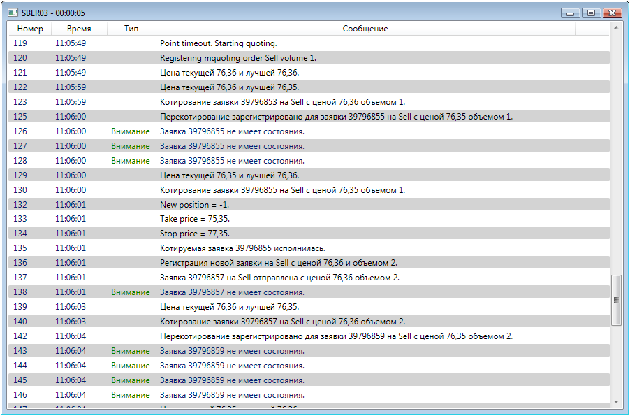

# Логирование Strategy

Класс [Strategy](xref:StockSharp.Algo.Strategies.Strategy) реализует интерфейс [ILogSource](xref:StockSharp.Logging.ILogSource). Поэтому стратегии можно передавать в [LogManager.Sources](xref:StockSharp.Logging.LogManager.Sources), и все ее сообщения будут автоматически попадать в [LogManager.Listeners](xref:StockSharp.Logging.LogManager.Listeners). 

### Предварительные условия

[Торговые стратегии](Strategy.md)

### Логирование в тестовый файл

Логирование в тестовый файл

1. В самом начале необходимо создать менеджер логирования: 

   ```cs
   var logManager = new LogManager();
   ```
2. Затем необходимо создать файловый логгер, передав в него имя файла, и добавить его в [LogManager.Listeners](xref:StockSharp.Logging.LogManager.Listeners): 

   ```cs
   var fileListener = new FileLogListener("{0}_{1:00}_{2:00}.txt".Put(DateTime.Now.Year, DateTime.Now.Month, DateTime.Now.Day));
   logManager.Listeners.Add(fileListener);
   ```
3. Для логирования сообщений необходимо добавить стратегию в [LogManager.Sources](xref:StockSharp.Logging.LogManager.Sources): 

   ```cs
   logManager.Sources.Add(lkohSmaStrategy);
   ```
4. После добавления стратегии в менеджер логирования все ее сообщения будут записаться в файл. 

### Проигрывание звука

Проигрывание звука

1. Создание логгера и передача в него имени звукового файла: 

   ```cs
   var soundListener = new SoundLogListener("error.mp3");
   						
   logManager.Listeners.Add(soundListener);
   logManager.Sources.Add(lkohSmaStrategy);
   ```
2. Установка фильтра на проигрывание звука только при сообщениях типа [LogLevels.Error](xref:StockSharp.Logging.LogLevels.Error): 

   ```cs
   soundListener.Filters.Add(msg => msg.Level == LogLevels.Error);
   ```

### Отсылка Email

Отсылка Email

1. Создание логгера и передача в него параметров отсылаемых писем: 

   ```cs
   var emailListener = new EmailLogListener("from@stocksharp.com", "to@stocksharp.com");
   logManager.Listeners.Add(emailListener);
   logManager.Sources.Add(lkohSmaStrategy);
   ```
2. Установка фильтра на отсылку сообщений типов [LogLevels.Error](xref:StockSharp.Logging.LogLevels.Error) и [LogLevels.Warning](xref:StockSharp.Logging.LogLevels.Warning): 

   ```cs
   emailListener.Filters.Add(msg => msg.Level == LogLevels.Error);
   emailListener.Filters.Add(msg => msg.Level == LogLevels.Warning);
   ```

### Логирование в LogWindow

Логирование в LogWindow

1. Создание логгер [GuiLogListener](xref:StockSharp.Xaml.GuiLogListener): 

   ```cs
   // каждая стратегия будет иметь свое собственное окно
   var guiListener = new GuiLogListener();
   logManager.Listeners.Add(guiListener);
   logManager.Sources.Add(lkohSmaStrategy);
   ```
2. Вот как выглядит окно логов при работе стратегии котирования заявок ([Котирование](StrategyQuoting.md)): 

## См. также

[Визуальные компоненты логирования](GuiLogging.md)
