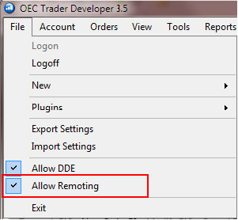

# Одновременная работа терминала и робота

При необходимости можно настроить терминал OEC Trader для работы в режиме [Primary](../api/StockSharp.OpenECry.OpenECryRemoting.Primary.html), после чего запустить робота [S\#](StockSharpAbout.md) в режиме [Primary](../api/StockSharp.OpenECry.OpenECryRemoting.Primary.html). В этом случае терминал и робот будут использовать одно и то же соединение с сервером OEC. Для настройки следует отметить пункт меню File \-\> Allow Remoting в терминале OEC Trader:

