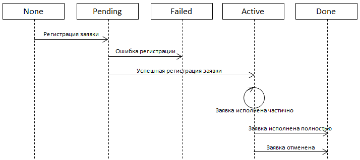

# Состояния заявок

Заявка во время своей жизни проходит следующие состояния:



- [None](xref:StockSharp.Messages.OrderStates.None) \- заявка была создана в роботе и еще не была отправлена на регистрацию. 
- [Pending](xref:StockSharp.Messages.OrderStates.Pending) \- заявка была отправлена на регистрацию ([ITransactionProvider.RegisterOrder](xref:StockSharp.BusinessEntities.ITransactionProvider.RegisterOrder(StockSharp.BusinessEntities.Order))) и для нее было вызвано событие [ITransactionProvider.NewOrder](xref:StockSharp.BusinessEntities.ITransactionProvider.NewOrder). Для заявки ожидается подтверждение ее принятия от биржи. В случае успеха принятия будет вызвано событие [ITransactionProvider.OrderChanged](xref:StockSharp.BusinessEntities.ITransactionProvider.OrderChanged), и заявка будет переведена в состояние [Active](xref:StockSharp.Messages.OrderStates.Active). Также будут проинициализированы свойства [Order.Id](xref:StockSharp.BusinessEntities.Order.Id) и [Order.Time](xref:StockSharp.BusinessEntities.Order.Time). В случае отвержения заявки будет вызвано событие [ITransactionProvider.OrderRegisterFailed](xref:StockSharp.BusinessEntities.ITransactionProvider.OrderRegisterFailed) с описанием ошибки, и заявка будет переведена в состояние [Failed](xref:StockSharp.Messages.OrderStates.Failed). 
- [Active](xref:StockSharp.Messages.OrderStates.Active) \- заявка активна на бирже. Такая заявка будет активна до тех пор, пока не исполнится весь ее выставленный объем [Order.Volume](xref:StockSharp.BusinessEntities.Order.Volume), или она не будет снята принудительно через [ITransactionProvider.CancelOrder](xref:StockSharp.BusinessEntities.ITransactionProvider.CancelOrder(StockSharp.BusinessEntities.Order)). Если заявка исполняется частично, то вызываются события [ITransactionProvider.NewMyTrade](xref:StockSharp.BusinessEntities.ITransactionProvider.NewMyTrade) о новых сделках по выставленной заявке, а так же событие [ITransactionProvider.OrderChanged](xref:StockSharp.BusinessEntities.ITransactionProvider.OrderChanged), где передается уведомление об изменении баланса по заявке [Order.Balance](xref:StockSharp.BusinessEntities.Order.Balance). Последнее событие будет выведено и в случае отмены заявки.
- [Done](xref:StockSharp.Messages.OrderStates.Done) \- заявка более не активна на бирже (была полностью исполнена или снята). 
- [Failed](xref:StockSharp.Messages.OrderStates.Failed) \- заявка не была принята биржей (или промежуточной системой, как, например, серверная часть торговой платформы) по какой\-либо причине. 

Для того, чтобы узнать, в каком торговом состоянии находится заявка (какой объем реализован, была ли полностью удовлетворена заявка и т.д.) необходимо использовать методы [IsCanceled](xref:StockSharp.Algo.TraderHelper.IsCanceled(StockSharp.BusinessEntities.Order)), [IsMatchedEmpty](xref:StockSharp.Algo.TraderHelper.IsMatchedEmpty(StockSharp.BusinessEntities.Order)), [IsMatchedPartially](xref:StockSharp.Algo.TraderHelper.IsMatchedPartially(StockSharp.BusinessEntities.Order)), [IsMatched](xref:StockSharp.Algo.TraderHelper.IsMatched(StockSharp.BusinessEntities.Order)) и [GetMatchedVolume](xref:StockSharp.Algo.TraderHelper.GetMatchedVolume(StockSharp.BusinessEntities.Order)):

```cs
// любая заявка
Order order = ....
// отменена ли
Console.WriteLine(order.IsCanceled());
// исполнилась ли полностью
Console.WriteLine(order.IsMatched());
// исполнилась ли частично
Console.WriteLine(order.IsMatchedPartially());
// исполнилась ли хотя бы одна часть заявки 
Console.WriteLine(order.IsMatchedEmpty());
// получить реализованный объем
Console.WriteLine(order.GetMatchedVolume());
```
