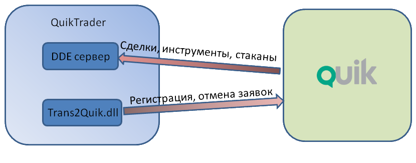

# Quik DDE (старое подключение)

Следующие разделы относятся к старому подключению к [Quik](Quik.md) при помощи DDE. Механизм взаимодействия показан на данном рисунке:

На рисунке показана связь по [DDE](https://en.wikipedia.org/wiki/Dynamic_Data_Exchange). [DDE](https://en.wikipedia.org/wiki/Dynamic_Data_Exchange) \- это технология самой быстрой передачи данных, которую поддерживает [QUIK](https://arqatech.com/ru/products/quik/). Преимущество [DDE](https://en.wikipedia.org/wiki/Dynamic_Data_Exchange) в том, что она умеет максимально быстро передавать большие объемы данных. Например, это полезно при передаче данных из таблицы всех сделок, когда в секунду может появляться до сотни сделок. 

> [!TIP]
> Рекомендуется использовать подключение [Quik Lua](QuikLua.md).

- [Настройка Quik](QuikSetup.md)
- [Verifier](QuikVerifier.md)
- [Создание первого робота](QuikFirstStrategy.md)
- [Экспорт стакана](QuikQuotesByDde.md)
- [Экспорт дополнительных колонок](QuikExtendedInfoByDde.md)
- [Экспорт произвольных таблиц](QuikAnyTableByDde.md)
- [Экспорт микросекунд](QuikMksByDde.md)
- [Таблица Инструменты (изменения)](QuikSecuritiesChangesTable.md)
- [Строка транзакции](QuikFormatTransaction.md)
- [Работа с несколькими Quik\-ами](QuikFew.md)
