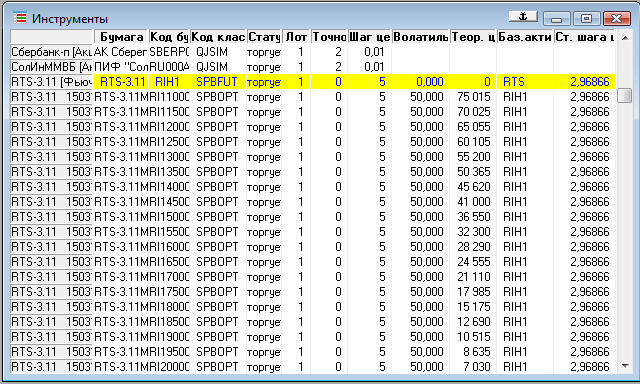
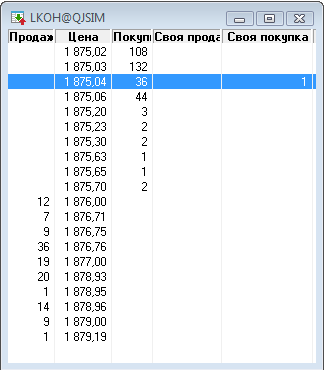
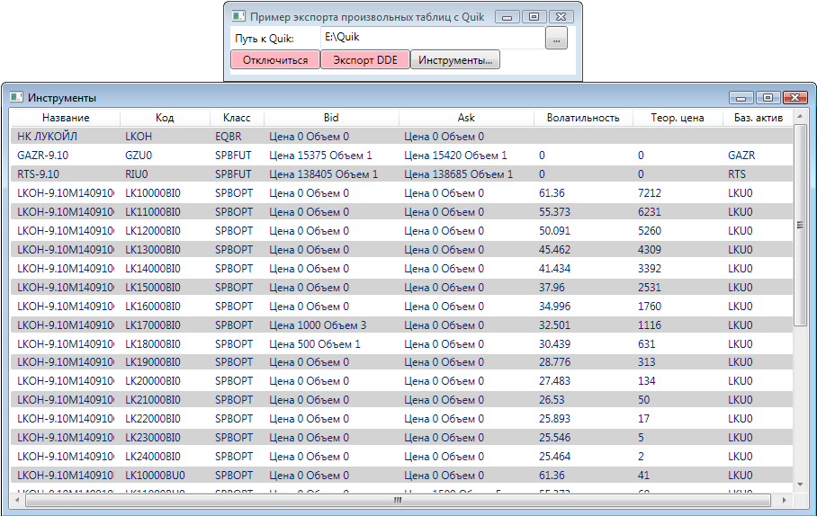
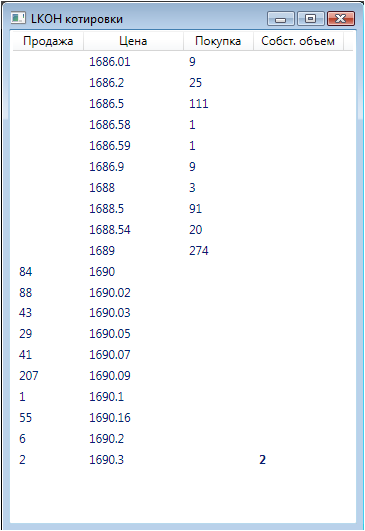

# Экспорт дополнительных колонок

[QuikTrader](xref:StockSharp.Quik.QuikTrader) в целях оптимизации экспортирует только минимальный набор данных из стандартных таблиц (Инструменты, Заявки и т.д.). Если для алгоритма необходимы данные из дополнительных колонок (или же требуется изменить порядок колонок, например, в таблице Инструменты размер лота идет сразу за название инструмента), то для этого существуют 2 варианта решения: 

1. Добавить отдельную таблицу в [Quik](Quik.md), которая будет дублировать существующую. Такую таблицу можно менять полностью, и это не отразиться на экспорте [DDE](https://en.wikipedia.org/wiki/Dynamic_Data_Exchange), так как экспорт будет идти по первой таблице. Единственное ограничение такого подхода \- такие таблицы не должны иметь одинаковый заголовок. 
2. Поменять существующую таблицу. А так же изменить метаданные, описывающие экспорт [DDE](https://en.wikipedia.org/wiki/Dynamic_Data_Exchange). Ниже рассмотрен пример такого сценария. 

### Предварительные условия

[Настройка Quik](QuikSetup.md)

### Экспорт дополнительных колонок

Экспорт дополнительных колонок

1. Пример работает с фьючерсными и опционными контрактами, и показывает как экспортировать колонки Волатильность, Теоретическая Цена, Базовый актив и Стоимость шага цены (пункт). Дополнительно, пример работает с расширенным стаканом, получая информацию о собственных объемах в котировках. 

   > [!TIP]
   > Исходные коды примера лежат в папке *Samples\\Quik\\DDE\\SampleDdeExtendedInfo*. Файл настроек для [Quik](Quik.md) называется info\_extended.wnd.
2. Вначале, необходимо настроить таблицу Инструменты: 
3. А так же окно со стаканом: 

   > [!TIP]
   > Пример работает с инструментом Лукойл. Для использования других инструментов необходимо настроить окна со стаканами по аналогии. 
4. Далее, необходимо изменить метаданные для инструментов и стаканов. Это делается через таблицу [DdeTable](xref:StockSharp.Quik.DdeTable). Для каждого типа торгового объекта существует своя отдельная таблица с метаданными, которые получаются через [QuikTrader](xref:StockSharp.Quik.QuikTrader): 

   | Название таблицы
        | Свойство с метаданными
                                                                            |
   | ------------------------- | --------------------------------------------------------------------------------------------------- |
   | Инструменты
             | [QuikTrader.SecuritiesTable](xref:StockSharp.Quik.QuikTrader.SecuritiesTable)
                     |
   | Мои сделки
              | [QuikTrader.MyTradesTable](xref:StockSharp.Quik.QuikTrader.MyTradesTable)
                         |
   | Все сделки
              | [QuikTrader.TradesTable](xref:StockSharp.Quik.QuikTrader.TradesTable)
                             |
   | Заявки
                  | [QuikTrader.OrdersTable](xref:StockSharp.Quik.QuikTrader.OrdersTable)
                             |
   | Стоп\-заявки
            | [QuikTrader.StopOrdersTable](xref:StockSharp.Quik.QuikTrader.StopOrdersTable)
                     |
   | Портфель по бумагам
     | [QuikTrader.EquityPortfoliosTable](xref:StockSharp.Quik.QuikTrader.EquityPortfoliosTable)
         |
   | Портфель по деривативам
 | [QuikTrader.DerivativePortfoliosTable](xref:StockSharp.Quik.QuikTrader.DerivativePortfoliosTable)
 |
   | Позиции по бумагам
      | [QuikTrader.EquityPositionsTable](xref:StockSharp.Quik.QuikTrader.EquityPositionsTable)
           |
   | Позиции по деривативам
  | [QuikTrader.DerivativePositionsTable](xref:StockSharp.Quik.QuikTrader.DerivativePositionsTable)
   |
   | Стакан
                  | [QuikTrader.QuotesTable](xref:StockSharp.Quik.QuikTrader.QuotesTable)
                             |

   Через [QuikTrader.SecuritiesTable](xref:StockSharp.Quik.QuikTrader.SecuritiesTable) и [QuikTrader.QuotesTable](xref:StockSharp.Quik.QuikTrader.QuotesTable) добавляются требуемые колонки в том порядке, в которым они были добавлены в [Quik](Quik.md): 

   ```cs
   // добавляем на экспорт необходимые колонки
   this.Trader.SecuritiesTable.Columns.Add(DdeSecurityColumns.Volatility);
   this.Trader.SecuritiesTable.Columns.Add(DdeSecurityColumns.TheorPrice);
   this.Trader.SecuritiesTable.Columns.Add(DdeSecurityColumns.BaseSecurity);
   this.Trader.SecuritiesTable.Columns.Add(DdeSecurityColumns.MinStepPrice);
   // добавляем экспорт дополнительных колонок из стакана (своя продажа и покупка)
   this.Trader.QuotesTable.Columns.Add(DdeQuoteColumns.OwnAskVolume);
   this.Trader.QuotesTable.Columns.Add(DdeQuoteColumns.OwnBidVolume);
   ```

   Если колонки добавляются не в конец, а перемешаны с основными колонками, то необходимо вставлять колонки относительно их порядка следования друг за другом в таблице: 

   ```cs
   // вставить колонку волатильность, чтобы она была 5-ой с начала (нумерация идет с нуля)
   // все последующие колонки за волатильностью автоматически перестраивают свой порядковый номер
   this.Trader.SecuritiesTable.Columns.Insert(4, DdeSecurityColumns.Volatility);
   ```
5. После этого, через события [Connector.NewSecurity](xref:StockSharp.Algo.Connector.NewSecurity) и [Connector.SecurityChanged](xref:StockSharp.Algo.Connector.SecurityChanged) будут приходить объекты [Security](xref:StockSharp.BusinessEntities.Security), содержащие расширенную информацию. Чтобы ее получить в коде, необходимо воспользоваться свойством [Security.ExtensionInfo](xref:StockSharp.BusinessEntities.Security.ExtensionInfo): 

   ```cs
   Trader.NewSecurity += security => _securitiesWindow.SecurityPicker.Securities.Add(security);
   					
   ```

   > [!TIP]
   > [Security](xref:StockSharp.BusinessEntities.Security) имеет ряд свойств, которые упрощают доступ к расширенной информации. Это свойства [OpenPrice](xref:StockSharp.BusinessEntities.Security.OpenPrice), [ClosePrice](xref:StockSharp.BusinessEntities.Security.ClosePrice), [HighPrice](xref:StockSharp.BusinessEntities.Security.HighPrice), [LowPrice](xref:StockSharp.BusinessEntities.Security.LowPrice), [MaxPrice](xref:StockSharp.BusinessEntities.Security.MaxPrice), [MinPrice](xref:StockSharp.BusinessEntities.Security.MinPrice), [StepPrice](xref:StockSharp.BusinessEntities.Security.StepPrice), [MarginBuy](xref:StockSharp.BusinessEntities.Security.MarginBuy), [MarginSell](xref:StockSharp.BusinessEntities.Security.MarginSell), [ExpiryDate](xref:StockSharp.BusinessEntities.Security.ExpiryDate) и [SettlementDate](xref:StockSharp.BusinessEntities.Security.SettlementDate). Поэтому в примере Стоимость шага цены берется не через [Security.ExtensionInfo](xref:StockSharp.BusinessEntities.Security.ExtensionInfo), а через [Security.StepPrice](xref:StockSharp.BusinessEntities.Security.StepPrice)
6. Получения стакана:

   ```cs
   private void DepthClick(object sender, RoutedEventArgs e)
   {
   	var trader = MainWindow.Instance.Trader;
   	var window = _quotesWindows.SafeAdd(SecurityPicker.SelectedSecurity, security =>
   	{
   		// начинаем получать котировки стакана
   		trader.SubscribeMarketDepth(security);
   		// создаем окно со стаканом
   		var wnd = new QuotesWindow { Title = security.Id + " " + LocalizedStrings.MarketDepth };
   		wnd.MakeHideable();
   		return wnd;
   	});
   	if (window.Visibility == Visibility.Visible)
   		window.Hide();
   	else
   		window.Show();
   	if (!_initialized)
   	{
   		TraderOnMarketDepthChanged(trader.GetMarketDepth(SecurityPicker.SelectedSecurity));
   		trader.MarketDepthChanged += TraderOnMarketDepthChanged;
   		_initialized = true;
   	}
   }
   ```
7. В итоге должно получиться следующее: 

   И для стакана Лукойл: 

### Следующие шаги

[Экспорт произвольных таблиц](QuikAnyTableByDde.md)

## См. также
