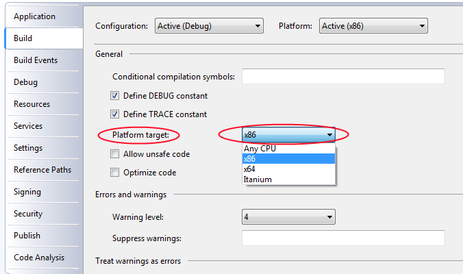

# Создание первого робота

Смысл робота\-примера в следующем: программа находит бумагу *Лукойл*, запоминает первоначальное значение середины спреда равное *(bid + ask) \/ 2*. Далее, как только значение спреда отклонится на *0.1%*, то выставляется заявка на покупку объемом 1 и ценой текущего спреда. Далее, если произойдет сделка по выставленной заявке, то программа выведет информацию по этой сделке. 

> [!CAUTION]
> Библиотека TRANS2QUIK.dll программы [Quik](Quik.md) имеет ограничение в разрядности \- написана под 32\-х разрядные платформы. Поэтому, при компилировании программы необходимо явно указывать разрядность:   
>   
> Это позволит запускать торговых роботов под [Quik](Quik.md) на 64\-х разрядных операционных системах. 

> [!TIP]
> Исходные коды примера лежат в дистрибутиве в папке *Samples\\Quik\\DDE\\SampleConsole*.

### Необходимые действия:

Необходимые действия:

1. В самом начале необходимо создать шлюз к торговой системе [Quik](Quik.md), используя класс [QuikTrader](../api/StockSharp.Quik.QuikTrader.html):

   ```cs
   					// создаем шлюз к Quik-у
   					var trader = new QuikTrader(@"Ваш путь к Квик директории") { IsDde = true } ;
   ```
2. Затем создадим список таблиц, данные которых будут экспортироваться по DDE.

   ```cs
   		     		trader.DdeTables = new[] { trader.SecuritiesTable, trader.MyTradesTable, trader.EquityPositionsTable, trader.EquityPortfoliosTable, trader.OrdersTable };
   		     
   ```
3. После создания шлюза необходимо подключиться к торговой системе, используя метод [IConnector.Connect](../api/StockSharp.BusinessEntities.IConnector.Connect.html). Данный метод асинхронный, то есть результат его выполнения не гарантирует мгновенное установление соединения. Для точного определения, что соединение было установлено, необходимо использовать событие [IConnector.Connected](../api/StockSharp.BusinessEntities.IConnector.Connected.html): 

   ```cs
   // подписываемся на событие успешного подключения
   // все действия необходимо производить только после подключения
   trader.Connected += () =>
   {
   	Console.WriteLine("Подключение было произведено успешно.");
   	// извещаем об успешном соединении
   	waitHandle.Set();
   };
   Console.WriteLine("Производим подключение...");
   trader.Connect();
   // дожидаемся события об успешном соединении
   waitHandle.WaitOne();
   ```
4. Далее, необходимо подписаться на события появления информации по инструментам (так программа получит сведения по бумаге Лукойл), и портфелям (для выставления заявок). А также на событие появления Моих Сделок (сигнал пользователю о том, что произошла сделка по его заявке):

   ```cs
   trader.NewPortfolio += portfolio =>
   {
   	if (_portfolio == null && portfolio.Name == account)
   	{
   		// находим нужный портфель и присваиваем его переменной _portfolio
   		_portfolio = portfolio;
   		Console.WriteLine(LocalizedStrings.Str2171Params, account);
   		// если инструмент и стакан уже появились,
   		// то извещаем об этом основной поток для выставления заявки
   		if (_lkoh != null && _depth != null)
   			waitHandle.Set();
   	}
   };
   // подписываемся на событие появление инструментов
   trader.NewSecurity += security =>
   {
   	if (_lkoh == null)
   	{
   		if (!security.Code.CompareIgnoreCase(secCode))
   			return;
   		// находим Лукойл и присваиваем ее переменной lkoh
   		_lkoh = security;
   		if (_lkoh != null)
   		{
   			Console.WriteLine(LocalizedStrings.Str2987);
   			// запускаем экспорт стакана
   			trader.SubscribeMarketDepth(_lkoh);
   			if (_portfolio != null && _depth != null)
   				waitHandle.Set();
   		}
   	}
   };
   // подписываемся на событие появления моих новых сделок
   trader.NewMyTrade += myTrade =>
   {
   	var trade = myTrade.Trade;
   	Console.WriteLine(LocalizedStrings.Str2173Params, trade.Id, trade.Price, trade.Security.Code, trade.Volume, trade.Time);
   };
   // подписываемся на событие обновления стакана
   trader.MarketDepthChanged += depth =>
   {
   	if (_depth == null && _lkoh != null && depth.Security == _lkoh)
   	{
   		_depth = depth;
   		Console.WriteLine(LocalizedStrings.Str2988);
   		// если портфель и инструмент уже появился, то извещаем об этом основной поток для выставления заявки
   		if (_portfolio != null && _lkoh != null)
   			waitHandle.Set();
   	}
   };
   ```

   В обработчике [Connector.NewSecurity](../api/StockSharp.Algo.Connector.NewSecurity.html) запускается экспорт стакана для того, чтобы начали обновляться такие поля как [Security.BestBid](../api/StockSharp.BusinessEntities.Security.BestBid.html), [Security.BestAsk](../api/StockSharp.BusinessEntities.Security.BestAsk.html) и [Security.BestPair](../api/StockSharp.BusinessEntities.Security.BestPair.html). Подробнее, в разделе [Экспорт стакана](QuikQuotesByDde.md). 

   > [!CAUTION]
   > Номер счета, который в примере записан в переменную **account**, это **не логин** в [Quik](Quik.md), а код клиента. Об особенности портфелей в Quik читайте в соответствующем [разделе](QuikPortfolio.md). 

   Когда данные начнут приходить в [QuikTrader](../api/StockSharp.Quik.QuikTrader.html), то будут вызываться события [Connector.NewSecurity](../api/StockSharp.Algo.Connector.NewSecurity.html), [Connector.NewOrder](../api/StockSharp.Algo.Connector.NewOrder.html) и т.д. Для тех данных, которые изменяются, вызывается другое событие. Например, для заявок, у которых изменяются значения Состояние, Остаток и т.д. будет вызвано событие [Connector.OrderChanged](../api/StockSharp.Algo.Connector.OrderChanged.html). 

   Независимо от того, созданы ли данные программно, например, заявки, или же пользователь сам вручную зарегистрировал заявку, для новых данных в таблице Заявки будет вызвано событие [ITransactionProvider.NewOrder](../api/StockSharp.BusinessEntities.ITransactionProvider.NewOrder.html). Это очень удобно в случае, когда пользователь отменяет выставленную заявку, и программа продолжает работать с актуальными данными. 
5. Торговый алгоритм робота:

   ```cs
   // 0.1% от изменения цены
   const decimal delta = 0.001m;
   // запоминаем первоначальное значение середины спреда
   var firstMid = _lkoh.BestPair.SpreadPrice / 2;
   if (_lkoh.BestBid == null || firstMid == null)
   	throw new Exception(LocalizedStrings.Str2990);
   Console.WriteLine(LocalizedStrings.Str2991Params, _lkoh.BestBid.Price + firstMid);
   while (true)
   {
   	var mid = _lkoh.BestPair.SpreadPrice / 2;
   	// если спред вышел за пределы нашего диапазона
   	if (mid != null &&
   			((firstMid + firstMid * delta) <= mid ||
   			(firstMid - firstMid * delta) >= mid)
   		)
   	{
   		var order = new Order
   		{
   			Portfolio = _portfolio,
   			Price = _lkoh.ShrinkPrice(_lkoh.BestBid.Price + mid.Value),
   			Security = _lkoh,
   			Volume = 1,
   			Direction = Sides.Buy,
   		};
   		trader.RegisterOrder(order);
   		Console.WriteLine(LocalizedStrings.Str1157Params, order.Id);
   		break;
   	}
   	else
   		Console.WriteLine(LocalizedStrings.Str2176Params, _lkoh.BestBid.Price + mid);
   	// ждем 1 секунду
   	Thread.Sleep(1000);
   }
   ```
6. Завершение работы алгоритма:

   ```cs
   						// останавливаем подключение
   						trader.Disconnect();
   ```

### Следующие шаги

[Снятие заявок](OrdersCancel.md)

[Замена заявок](OrdersReRegister.md)

## См. также
