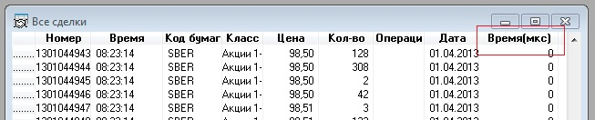
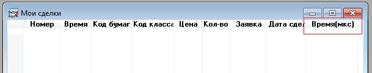

# Экспорт микросекунд

Начиная с версии 6.3, [Quik](Quik.md) поддерживает экспорт микросекунд для следующих таблиц: 

1. Таблица всех сделок (значение мкс. для времени регистрации сделки).
2. Таблица сделок (значение мкс. для времени регистрации сделки).
3. Таблица заявок (значение мкс. для времени регистрации и отмены сделки).

Для получения информации по микросекундам через [S\#](StockSharpAbout.md) необходимо добавить соответствующие столбцы в таблицы [Quik](Quik.md) и добавить экспорт доп. столбцов в настройках коннектора [Quik](Quik.md). Данные по микросекундам будут экспортироваться через стандартные свойства объектов [S\#](StockSharpAbout.md), например, для тиковых данных в поле [Trade.Time](xref:StockSharp.BusinessEntities.Trade.Time).

**Таблица всех сделок:**

1. Добавить столбец «Время (мкс)» в таблицу в [Quik](Quik.md).
2. Добавить экспорт доп. столбца.

   ```cs
   Trader.TradesTable.Columns.Add(DdeTradeColumns.TimeMs);
   ```

**Таблица сделок:**

1. Добавить столбец «Время (мкс)» в таблицу в [Quik](Quik.md).
2. Добавить экспорт доп. столбца.

   ```cs
   Trader.MyTradesTable.Columns.Add(DdeMyTradeColumns.TimeMs);
   ```

**Таблица заявок:**

1. Добавить столбцы «Выставлена (мкс)» и «Снята (мкс)» в таблицу в [Quik](Quik.md).
2. Добавить экспорт доп. столбцов.

   ```cs
   				Trader.OrdersTable.Columns.Add(DdeOrderColumns.TimeMs);
   				Trader.OrdersTable.Columns.Add(DdeOrderColumns.CancelTimeMs);
   				
   ```

> [!WARNING]
> Через [QuikTrader.TradesTable](xref:StockSharp.Quik.QuikTrader.TradesTable), [QuikTrader.MyTradesTable](xref:StockSharp.Quik.QuikTrader.MyTradesTable), [QuikTrader.OrdersTable](xref:StockSharp.Quik.QuikTrader.OrdersTable) дополнительные столбцы добавляются в том порядке, в котором они были добавлены в таблицах в [Quik](Quik.md) (См. раздел [«Экспорт дополнительных колонок»](QuikExtendedInfoByDde.md)).
