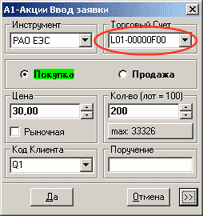

# Портфели в Quik

[Quik](Quik.md) одновременно поддерживает работу с несколькими торговыми площадками. Для каждой площадки понятие портфеля и используемых параметров разное.

### Площадки

Площадки

1. [ММВБ](https://moex.com/ru/markets/currency/) Для подачи заявок необходимо знать как код клиента, так и торговый счет. Код клиента получается из таблицы "Портфель по бумагам". Торговый счет для данного кода клиента может быть получен по одной из следующих таблиц: 
   - Заявки (столбец Счет) 
   - Стоп\-заявки (столбец Счет) 
   - Позиции по бумагам (столбец Счет депо) 
     1. Если для одного кода клиента присутствует несколько различных счетов депо (к примеру, для биржи ММВБ и РТС СГК) необходимо данную таблицу отфильтровать таким образом, чтобы для кода клиента присутствовал только счёт депо на нужной торговой площадке. Делается это через контекстное меню (*Редактировать таблицу \-\> Фильтр счетов депо*). В выбранные помещается тот счет депо, который отображается при подаче заявки. 
     2. Если никаких позиций в таблице нет (и в контекстном меню *Редактировать таблицу* отмечен пункт *Показывать нулевые лимиты*), необходимо либо задать позицию вручную через *Задать лимит по бумагам*, либо *отправить через [Quik](Quik.md) любую заявку (стоп\-заявку) по данному коду клиенту и нужной бирже*. Во втором случае торговый счет будет взят из таблицы Заявки (Стоп\-заявки). 
     3. В ином случае все настроено верно и дополнительных настроек делать не требуется. 

   > [!CAUTION]
   > Пока нет Торгового счета заявку на [ММВБ](https://moex.com/ru/markets/currency/) подать не удастся. 
2. [ФОРТС](https://moex.com/ru/derivatives/) Для подачи заявок необходимо знать только торговый счет, который получается из таблицы Портфель по деривативам. Код клиента на рынке [ФОРТС](https://moex.com/ru/derivatives/) совпадает с торговым счетом. 

### Следующие шаги

[Verifier](QuikVerifier.md)

## См. также
