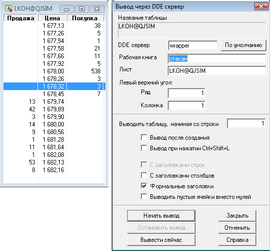

# Экспорт стакана

Для стратегий, которым необходима информация о стакане по инструменту, в [S\#](StockSharpAbout.md) предусмотрен метод [Connector.GetMarketDepth](xref:StockSharp.Algo.Connector.GetMarketDepth). Данный метод возвращает [MarketDepth](xref:StockSharp.BusinessEntities.MarketDepth), который позволяет получить группировано по типу котировки (биды и оффера), а так же удобную работу с лучшими котировками и спредом. 

### Предварительные условия

[Настройка Quik](QuikSetup.md)

### Шаги настройки экспорта стакана

1. Для того, чтобы метод [Connector.GetMarketDepth](xref:StockSharp.Algo.Connector.GetMarketDepth) работал и в классе [QuikTrader](xref:StockSharp.Quik.QuikTrader), необходимо в начале настроить экспорт стакана в [Quik](Quik.md)\-е, как показано на рисунке: 

   > [!TIP]
   > Если стакан для необходимого инструмента еще ни разу не открывался в [Quik](Quik.md)\-е, то [QuikTrader](xref:StockSharp.Quik.QuikTrader) самостоятельно создаст окно в терминале и настроит его при вызове метода [SubscribeMarketDepth](xref:StockSharp.Algo.Connector.SubscribeMarketDepth) из кода программы. Или можно принудительно закрыть стакан в [Quik](Quik.md)\-е и он будет переоткрыт с уже корректными для [S\#](StockSharpAbout.md) настройками. 

   > [!CAUTION]
   > Если в таблице "Инструменты" включена сортировка по одному из столбцов, то при автоматическом открытии стакана методом [SubscribeMarketDepth](xref:StockSharp.Algo.Connector.SubscribeMarketDepth), любая сортировка будет отменена. 

   

   Заголовок окна должен содержать через @ код и класс инструмента, по которому в [QuikTrader](xref:StockSharp.Quik.QuikTrader) будет происходить сопоставление объекта [Security](xref:StockSharp.BusinessEntities.Security) и стакана. Например, для Лукойла заголовок будет **LKOH@TQBR**. Для инструментов [РТС](http://rts.ru/) класс инструмента будет равен FORTS. Стакан для июньского фьючерса на индекс РТС, к примеру, будет иметь заголовок **RIM5@FORTS**. Подробнее, в разделе [Идентификатор инструмента](SecurityId.md). 

   > [!CAUTION]
   > Если код инструмента содержит символ @, то рекомендуется поменять разделитель на другой символ через свойство [SecurityIdGenerator.Delimiter](xref:StockSharp.Algo.SecurityIdGenerator.Delimiter) у [Connector.SecurityIdGenerator](xref:StockSharp.Algo.Connector.SecurityIdGenerator). 
2. После настройки стакана, он будет доступен для экспорта. Для того, чтобы начать получать данные по [DDE](https://en.wikipedia.org/wiki/Dynamic_Data_Exchange) из стакана в программу необходимо вызвать метод [SubscribeMarketDepth](xref:StockSharp.Algo.Connector.SubscribeMarketDepth): 

   ```cs
   trader.SubscribeMarketDepth(lkoh);
   ```
3. Пример работы со стаканом: 

   ```cs
   					  	foreach (var qoute in trader.GetMarketDepth(lkoh))
   							{
   								Console.WriteLine("Направление {0} Объем {1} Цена {2}", qoute.OrderDirection, qoute.Volume, qoute.Price);
   							}
   					 
   ```
4. Остановка экспорта стакана по [DDE](https://en.wikipedia.org/wiki/Dynamic_Data_Exchange): 

   ```cs
   trader.UnRegisterQuotes(lkoh);
   ```
5. Для увеличения скорости передачи данных по [DDE](https://en.wikipedia.org/wiki/Dynamic_Data_Exchange) для стакана рекомендуется прописать в файл *info.ini* следующие параметры: 

   ```cs
   [excel] price-timeout=10
   ```

## См. также

[Экспорт дополнительных параметров](QuikExtendedInfoByDde.md)
