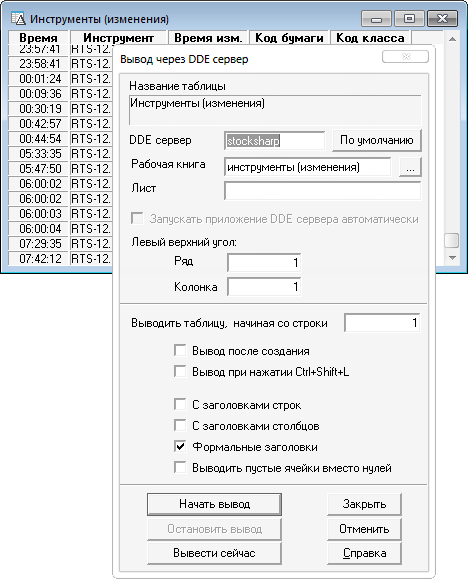

# Таблица Инструменты (изменения)

Таблица изменений является необязательной и настраивается при необходимости.

Таблица полезна, например, если необходимо получить все данные за текущий торговый день. Или сохранить в [S\#.Data](Hydra.md)\-е пропущенные данные или все данные в конце торгового дня. 



Инструменты (изменения) (Главное меню \-\> Таблицы \-\> Таблица изменений)

1. Время последнего изменения
2. Код бумаги
3. Код класса

> [!TIP]
> Колонки **Время** и **Инструмент** создаются QUIK автоматически.  
> Настройка таблицы производится точно также как и при [настройке экспорта дополнительных колонок](QuikExtendedInfoByDde.md).

Для того чтобы получать данные из этой таблицы необходимо добавить ее в экспорт:

```cs
private QuikTrader _trader;
...
_trader.UseSecuritiesChange = true;
		
```

Или, если используется экспорт конкретных таблиц, то добавить в список экспортируемых [SecuritiesChangeTable](../api/StockSharp.Quik.QuikTrader.SecuritiesChangeTable.html):

Новые данные будут приходить через событие [QuikTrader.NewSecurityChanges](../api/StockSharp.Quik.QuikTrader.NewSecurityChanges.html).
