# Настройка Quik

Перед началом работы [S\#](StockSharpAbout.md) с [Quik](Quik.md) (программирование или запуск уже написанных программ) необходимо правильно настроить торговый терминал. 

> [!CAUTION]
> После данного раздела рекомендуется прочитать о программе [Verifier](QuikVerifier.md), которая проверяет правильность настроек, сделанных в этом разделе. 

> [!CAUTION]
> [Quik](Quik.md) необходимо запускать из под той же учетной записи, что и запускается робот (рекомендуется от администратора). Если используется ОС Windows Vista или выше, то дополнительно необходимо, чтобы робот и [Quik](Quik.md) имели еще и одинаковые привилегии. 

> [!CAUTION]
> Имя исполняемого файла робота не должно совпадать с исполняемым файлом [Quik](Quik.md) ("info"). 

## Необходимые настройки Quik\-а:

- Включить поддержку внешних транзакций (необходимо для регистрации, снятия заявок). *Главное меню \-\> Торговля \-\> Внешние транзакции*: 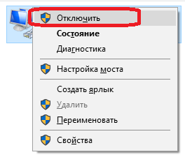
- Рекомендуется настроить автоматическое переподключение в случае разрыва связи. *Главное меню \-\> Связь \-\> Доступные соединения*: 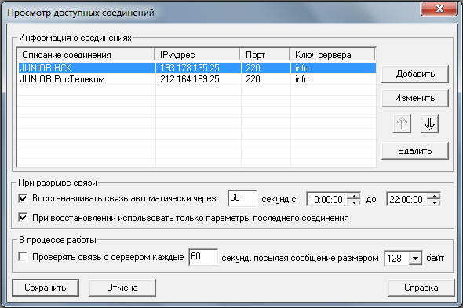
- Теперь необходимо правильно настроить таблицы, которые требуются для экспорта по [DDE](https://en.wikipedia.org/wiki/Dynamic_Data_Exchange). Настройки [DDE](https://en.wikipedia.org/wiki/Dynamic_Data_Exchange) для таблицы можно изменить через *правый клик на таблицу \-\> Вывод через DDE сервер.*

  Таблицы с инструментами, заявками, стоп\-заявками, всеми сделками, моими сделками, портфелями и позициями необходимо настроить как показано на следующих картинках (список колонок в текстовом виде как они называются в [Quik](Quik.md)\-е идет после картинок). Для портфелей и позиций используются по две таблицы, одна для ценных бумаг, другая для деривативов. , которая в [Quik](Quik.md) для портфеля называется "Клиентский портфель" и для позиции "Таблица лимитов по бумагам", другая для деривативов \- "Таблица позиций по клиентским счетам": 

  > [!TIP]
  > В дистрибутиве идет info.wnd. Это файл программы [Quik](Quik.md), в котором она хранит расположение окон с таблицами, графиками и т.д., а так же какие колонки были добавлены в таблицы. Данный файл уже содержит настройки программы [Quik](Quik.md), и не требуется самостоятельная настройка таблиц. Файлы загружаются через Главное меню \-\> Настройки \-\> Загрузить настройки из файла. Рекомендуется загружать настройки [S\#](StockSharpAbout.md) в отдельную закладку, если [Quik](Quik.md) уже был ранее настроен под другие программы или стиль торговли. Это позволит использовать совместно старые настройки и новые от [S\#](StockSharpAbout.md). 

  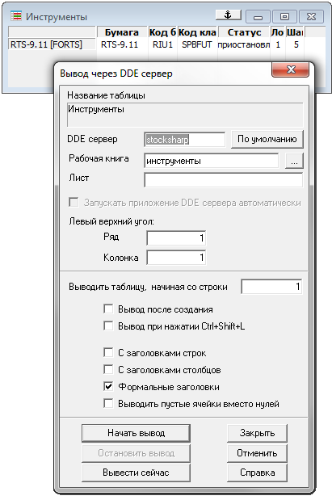

  Рисунок 1: Инструменты (Главное меню \-\> Таблицы \-\> Текущая таблица)
  1. Полное название бумаги
  2. Код бумаги
  3. Код класса
  4. Статус (Статус торговли инструментом)
  5. Размер лота
  6. Минимальный шаг цены

  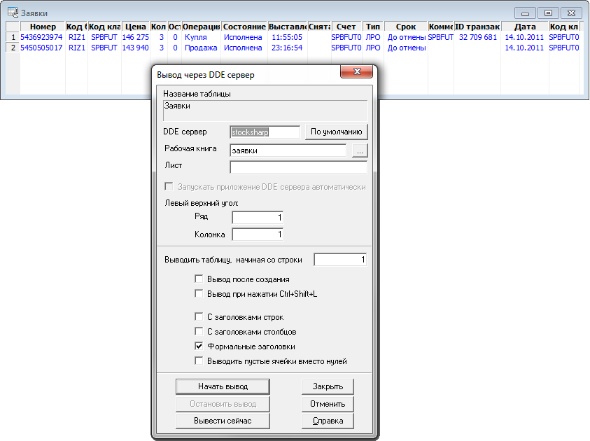

  Рисунок 2: Заявки (Главное меню \-\> Торговля \-\> Заявки)
  1. Номер
  2. Код бумаги
  3. Код класса
  4. Цена
  5. Кол\-во
  6. Остаток
  7. Операция
  8. Состояние
  9. Выставлена (время)
  10. Снята (время)
  11. Счет
  12. Тип
  13. Срок
  14. Комментарий
  15. ID транзакции
  16. Дата
  17. Код клиента

  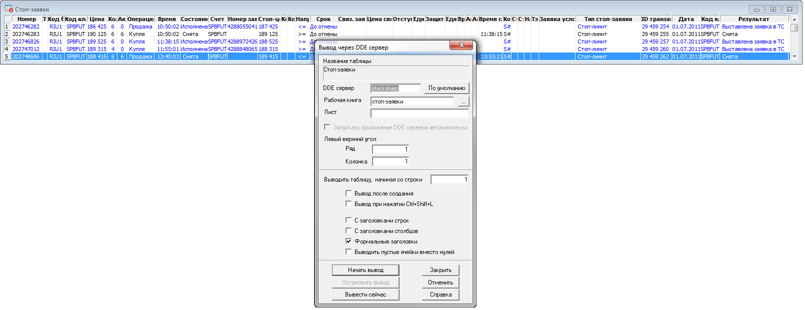

  Рисунок 3: Стоп\-заявки (Главное меню \-\> Таблицы \-\> Стоп\-заявки)
  1. Номер
  2. Тип
  3. Код бумаги
  4. Код класса
  5. Цена
  6. Кол\-во
  7. Акт. кол\-во
  8. Операция
  9. Время
  10. Состояние
  11. Счет
  12. Номер заявки
  13. Стоп\-цена
  14. Код бумаги стоп\-цены
  15. Код класса стоп\-цены
  16. Направление стоп\-цены
  17. Срок
  18. Связ. заявка
  19. Цена связ. заявки
  20. Отступ от min\/max
  21. Единицы отступа
  22. Защитный спрэд
  23. Единицы спрэда
  24. Время действия
  25. Активна с
  26. Активна по
  27. Время снятия
  28. Комментарий
  29. Стоп\-лимит по рыночной
  30. Стоп\-лимит цена
  31. Направление стоп\-лимит цены
  32. Тэйк\-профит по рыночной
  33. Заявка условия
  34. Тип стоп\-заявки
  35. ID транзакции
  36. Дата
  37. Код клиента
  38. Результат

  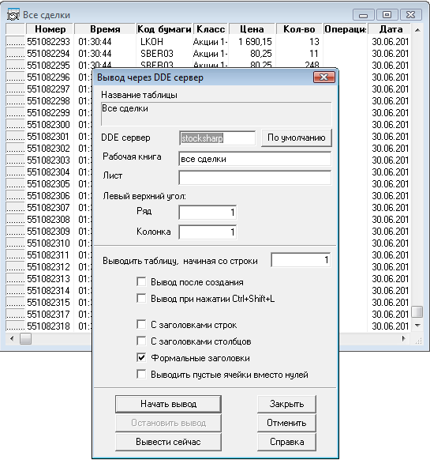

  Рисунок 4: Все сделки (Главное меню \-\> Таблицы \-\> Таблица всех сделок)
  1. Номер
  2. Время
  3. Код бумаги
  4. Класс
  5. Цена
  6. Кол\-во
  7. Операция
  8. Дата

  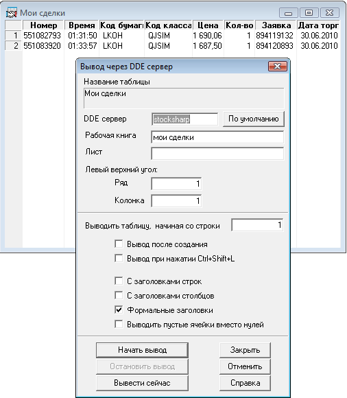

  Рисунок 5: Мои сделки (Главное меню \-\> Торговля \-\> Сделки)
  1. Номер
  2. Время
  3. Код бумаги
  4. Код класса
  5. Цена
  6. Кол\-во
  7. Заявка
  8. Дата торгов

  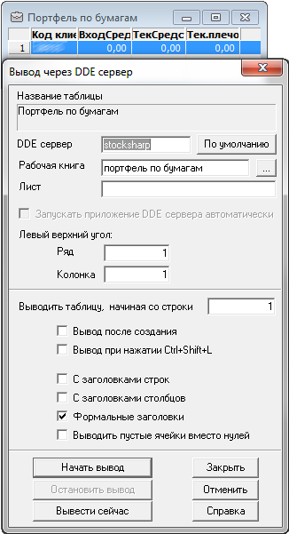

  Рисунок 6: Портфель по бумагам (Главное меню \-\> Лимиты \-\> Клиентский портфель)
  1. Код клиента
  2. ВходСредства
  3. ТекСредства
  4. Тек.плечо
  5. Вид лимита

  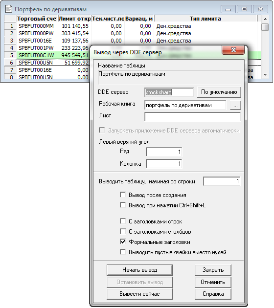

  Рисунок 6: Портфель по деривативам (Главное меню \-\> Торговля \-\> Фьючерсы \-\> Ограничения по клиентским счетам)
  1. Торговый счет
  2. Лимит откр. поз.
  3. Тек. чист. поз.
  4. Вариац. маржа
  5. Тип лимита

  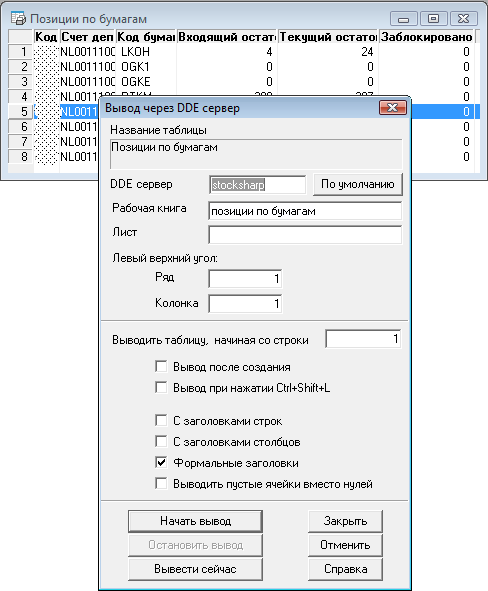

  Рисунок 6: Позиции по бумагам (Главное меню \-\> Лимиты \-\> Лимиты по бумагам)
  1. Код клиента
  2. Счет депо
  3. Код бумаги
  4. Входящий остаток
  5. Текущий остаток
  6. Заблокировано
  7. Вид лимита

  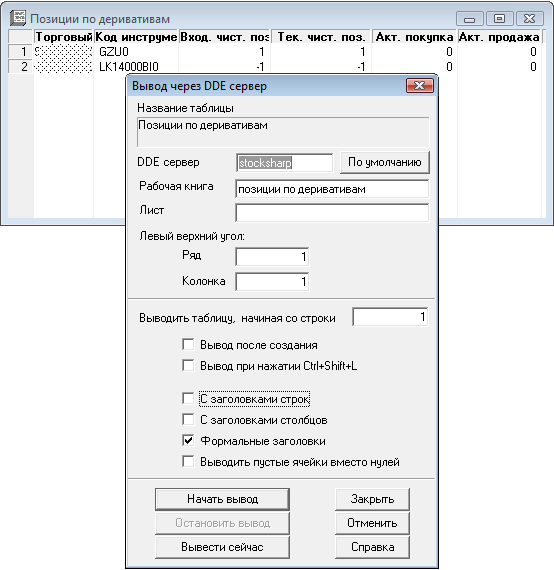

  Рисунок 7: Позиции по деривативам (Главное меню \-\> Торговля \-\> Фьючерсы \-\> Позиции по клиентским счетам)
  1. Торговый счет
  2. Код инструмента
  3. Вход. чист. поз.
  4. Тек. чист. поз.
  5. Акт. покупка
  6. Акт. продажа

  > [!CAUTION]
  > Колонки должны идти строго в том порядке, в котором показаны на рисунках. Это сделано из\-за того, что [QuikTrader](xref:StockSharp.Quik.QuikTrader) в целях оптимизации не обрабатывает заголовки колонок в таблицах, а основывается только на порядковом номере. Описание того, как можно менять порядок колонок в таблицах, не нарушая механизм работы [DDE](https://en.wikipedia.org/wiki/Dynamic_Data_Exchange), описан [Экспорт дополнительных колонок](QuikExtendedInfoByDde.md).

  > [!TIP]
  > Если экспорт [DDE](https://en.wikipedia.org/wiki/Dynamic_Data_Exchange) не работает (данные не поступаю в программу), то рекомендуется для диагностирования ошибки подключится к событию [IConnector.Error](xref:StockSharp.BusinessEntities.IConnector.Error).
- Для увеличения скорости передачи данных по [DDE](https://en.wikipedia.org/wiki/Dynamic_Data_Exchange) для стакана рекомендуется прописать в файл *info.ini* следующие параметры: 

  ```cs
  [excel]
  price-timeout=10
  ```

## Следующие шаги

[Портфели в Quik](QuikPortfolio.md)
