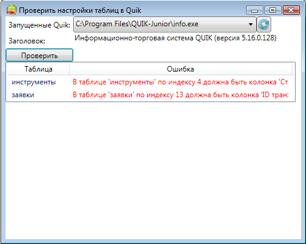
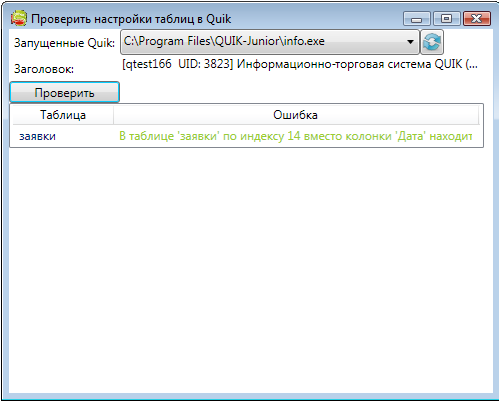
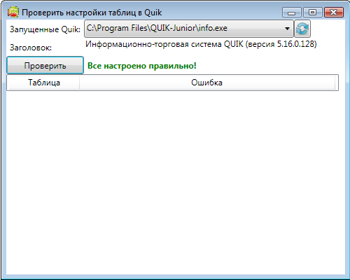

# Verifier

Для проверки правильности настроек [Quik](Quik.md), описанных в разделе [Настройка Quik](QuikSetup.md), в [S\#](StockSharpAbout.md) входит утилита **Verifier** (находится в дистрибутиве в папке Verifier). Программа проверяет: 

1. Включены ли Внешние Транзакции.
2. Созданы ли все необходимые таблицы (Инструменты, Заявки и т.д.).
3. Имеют ли данные таблицы правильные заголовки.
4. Все ли колонки присутствуют в таблице и выстроены ли они в правильном порядке.

При запуске **Verifier** автоматически выводит список запущенных в данный момент терминалов [Quik](Quik.md). Если [Quik](Quik.md) еще не запущен, необходимо его запустить, и нажать на кнопку  для повторного нахождения процессов [Quik](Quik.md). 

В случае неправильности настроек одного из предыдущих пунктов, программа выводит сообщения в отдельных окнах или в таблицу: 



Если идет торговля с биржей, для которой отсутствует необходимая колонка в [Quik](Quik.md), то можно заменить колонку эквивалентной по типу данных (колонку с датой заменить на другой колонку с датой, с числом на число, с денежным выражением на денежное). В этом случае **Verifier** выводит предупреждение, но подтверждает правильность настроек: 



Если все настройки сделаны правильно, программа выводит следующее: 



Иногда требуется модификация стандартных таблиц, как это показано в разделе [Экспорт дополнительных колонок](QuikExtendedInfoByDde.md). В этом случае для проверки правильности настроек необходимо вызывать напрямую из разрабатываемого приложения метод [QuikTerminal.GetTableSettings](../api/StockSharp.Quik.QuikTerminal.GetTableSettings.html): 

```cs
this.OkResult.SetVisibility(false);
this.SettingErrors.Clear();
// ...
this.SettingErrors.AddRange(trader.Terminal.GetTableSettings());
if (this.SettingErrors.Count == 0)
	this.OkResult.SetVisibility(true);
```

> [!TIP]
> Пример работы с данным методом находится в исходниках программы Verifier, которые также идут в дистрибутиве. 

### Следующие шаги

[Создание первой стратегии](QuikFirstStrategy.md)

## См. также
