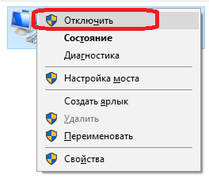

# Настройки переподключения

### Визуальная настройка переподключения

Визуальная настройка переподключения

Все коннекторы предоставляют возможность настраивать переподключение на случай разрыва соединения. В графическом элементе [Окно настройки подключений](API_UI_ConnectorWindow.md) это выглядит следующим образом: 


**Свойтва переподключения**

- **Интервал**

   \- Интервал, с которым будут происходить попытки подключения. 
- **Первоначально**

   \- Количество попыток установить первоначальное соединение, если оно не было установлено (тайм\-аут, сетевой сбой и тд). 
- **Переподключение**

   \- Количество попыток переподключиться, если подключение было разорвано в процессе работы. 
- **Время ожидания**

   \- Время ожидания успешного подключения\/отключения. 
- **Режим работы**

   \- Режим работы, во время которого необходимо производить подключения. 

### Программная настройка переподключения

Программная настройка переподключения

Механизм переподключения настраивается через свойство [Connector.ReConnectionSettings](../api/StockSharp.Algo.Connector.ReConnectionSettings.html) и позволяет отслеживать следующие сценарии ошибок: 

- Невозможно установить соединение (отсутствует связь, неправильный логин\-пароль и т.д.). Через свойство 

  [ReConnectionSettings.AttemptCount](../api/StockSharp.Messages.ReConnectionSettings.AttemptCount.html)

   задается количество попыток для установки соединения. По умолчанию оно равно 0, что означает, что режим отключен. \-1 означает бесконечное количество попыток. 
- Соединение было разорвано в процессе работы. Через свойство 

  [ReConnectionSettings.ReAttemptCount](../api/StockSharp.Messages.ReConnectionSettings.ReAttemptCount.html)

   задается количество попыток для переустановки соединения. По умолчанию оно равно 100. \-1 означает бесконечное количество попыток. 0 \- режим отключен. 
- В процессе установки или отключения соединения соответствующие события 

  [IConnector.Connected](../api/StockSharp.BusinessEntities.IConnector.Connected.html)

   или 

  [IConnector.Disconnected](../api/StockSharp.BusinessEntities.IConnector.Disconnected.html)

   могут не приходить долгое время. Для таких ситуаций можно использовать свойство 

  [ReConnectionSettings.TimeOutInterval](../api/StockSharp.Messages.ReConnectionSettings.TimeOutInterval.html)

  , чтобы задать максимально допустимое время отсутствия успешного события. Если по истечению данного времени желаемое событие не возникает, то вызывается событие 

  [IConnector.ConnectionError](../api/StockSharp.BusinessEntities.IConnector.ConnectionError.html)

   с ошибкой окончания ожидания. 

1. При создании шлюза необходимо проинициализировать настройки механизма переподключений через свойство [Connector.ReConnectionSettings](../api/StockSharp.Algo.Connector.ReConnectionSettings.html): 

   ```cs
   // инициализируем механизм переподключения (будет автоматически соединяться
   // каждые 10 секунд, если шлюз потеряется связь с сервером)
   Connector.ReConnectionSettings.Interval = TimeSpan.FromSeconds(10);
   // переподключение будет работать только во время работы биржи РТС
   // (чтобы отключить переподключение когда торгов нет штатно, например, ночью)
   Connector.ReConnectionSettings.WorkingTime = Exchange.Rts.WorkingTime;
   ```
2. Чтобы проверить, как работает механизм контроля соединения, можно выключить подключение к Интернету: 

   
3. Ниже приведен лог программы, в котором видно, что приложение изначально находиться в подключенном состоянии, а после выключения интернета приложение пытается переподключиться. После восстановления интернета восстанавливается подключение приложения: 

   
4. Так как в [Connector](../api/StockSharp.Algo.Connector.html) может использоваться несколько подключений, то по умолчанию события связанные с переподключением такие как [Connector.Restored](../api/StockSharp.Algo.Connector.Restored.html) не вызываются, а адаптеры подключений самостоятельно пытаются переподключиться. Для того чтобы событие начало вызываться необходимо у адаптера выставить свойство [BasketMessageAdapter.SuppressReconnectingErrors](../api/StockSharp.Algo.BasketMessageAdapter.SuppressReconnectingErrors.html) в **false**. 

   ```cs
   Connector.Adapter.SuppressReconnectingErrors = false;
   Connector.ConnectionError += error => this.Sync(() => MessageBox.Show(this, "Соединение потеряно"));
   Connector.Restored += () => this.Sync(() => MessageBox.Show(this, "Соединение восстановлено"));
   ```

   
