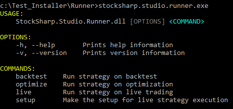

# Командная строка

**Runner**, являясь консольной программой, предоставляет возможность запуска в разных режимах через указание параметров в командной строке. При запуске программы без параметров она выведет справку, какие доступны параметры:



Запуск **Runner** для тестирования на истории:

```cmd
b -s SmaStrategy.cs -h \"C:\\Storage\" --hf 20200401 --ht 20200430 --sec SBER@TQBR -r json
```

Доступные параметры:

- -s - путь к файлу со стратегией (с расширением cs, json или dll).
- -t - (не обязательно) в случае если был выбран dll файл, и сборка содержат более 1 класса стратегии, необходимо указать нужный тип через данный параметр.
- -h - путь к директории с историческими данными. Может быть адрес в сети в случае использования режима [сервера](HydraServer.md).
- --hl - (не обязательно) логин, используется в случае режима [сервера](HydraServer.md).
- --hp - (не обязательно) пароль, используется в случае режима [сервера](HydraServer.md).
- --hf - дата начала тестирования в формате YYYYMMDD.
- --ht - дата окончания тестирования в формате YYYYMMDD.
- -f - (не обязательно) формат хранилища (Binary или Csv).
- --sec - (не обязательно) [идентификатор инструмента](SecurityId.md).
- -r - (не обязательно) формат отчета с результатами тестирования (json, xml, csv).
- --tm - (не обязательно) таймаут работы стратегии.
- --memory - (не обязательно) максимальный размер занимаемой памяти (в мегабайтах).
- --cpu - (не обязательно) маска процессора.
- -l - (не обязательно) уровень логирования (Info, Debug, Error, Warning, Verbose).

Запуск **Runner** для оптимизации:

```cmd
o -s SmaStrategy.cs -h "C:\Storage" --hf 20200401 --ht 20200430 --sec SBER@TQBR -r json -p sma_optimization.json
```
Все параметры режима тестирования на истории, плюс дополнительные:

- -p - путь к файлу с параметрами.
- --ol - (не обязательно) максимальное количество итераций.
- --ob - (не обязательно) количество однвоременное тестируемых стратегий.

Формат файла с параметрами:

```json
[
  {
    "Name": "SMA_80",
    "Value": "200,201"
  },
  {
    "Name": "SMA_30",
    "From": "40",
    "To": "50",
    "Step": "1"
  },
  {
    "Name": "Security",
    "Value": "SBER@TQBR,GAZP@TQBR"
  }
]
```

Запуск **Runner** для live торгов:

```cmd
l -s SmaStrategy.cs -c connector.json --tg telegram.json
```

- -c - файл с настройками подключения.
- --tg - файл с настройками телеграм интеграции.