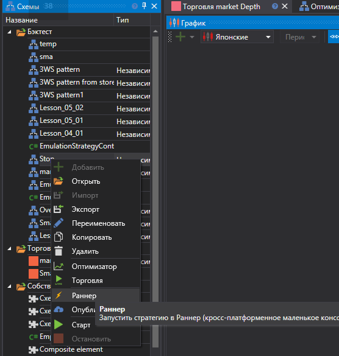
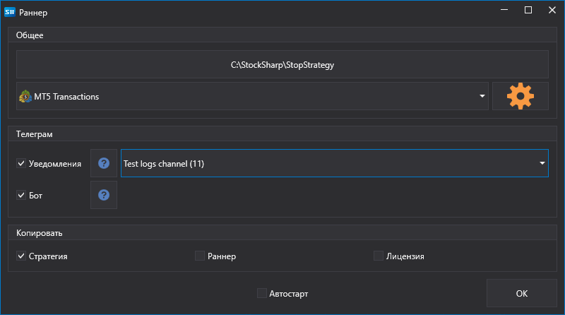

# Экспорт из Дизайнера

**Runner** позволяет запускать стратегии, созданные в [Designer](Designer.md). Это наиболее удобный способ настройки **Runner** так как в этом случае вся конфигурация производится визуальным способом.

Чтобы осуществить экспорт стратегии из [Designer](Designer.md):

- Выберите нужную стратегию в дереве, нажмите правую кнопку мыши и выберите пункт меню **Runner**:

  

- В появившемся окне необходимо выбрать какие типы подключений нужно экспортировать в **Runner**, а также настройки для управления стратегией через [Telegram](Telegram.md):

  

В выбранную для экспорта директорию будут скопированы следующие файлы:

- connector.json - файл, содержащий настройки подключения
- params.json - файл, содержащий параметры стратегии
- start.bat - bat-файл с уже прописанной командной строкой для быстрого запуска **Runner**
- strategy.json - файл, содержащий стратегию
- connector.json - файл, содержащий настройки подключения
- telegram.json - файл, содержащий настройки интеграции с [Telegram](Telegram.md)
