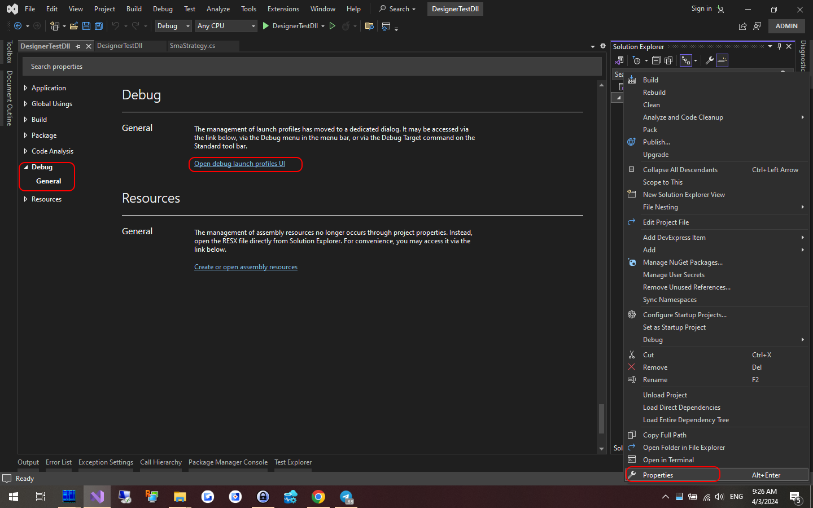
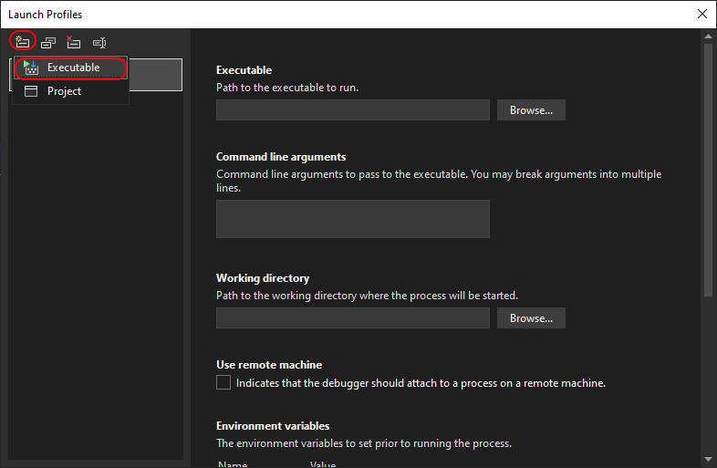
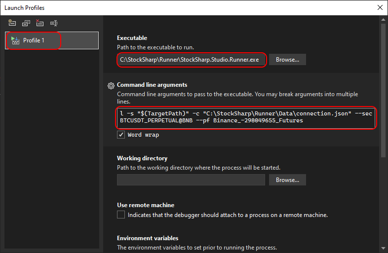
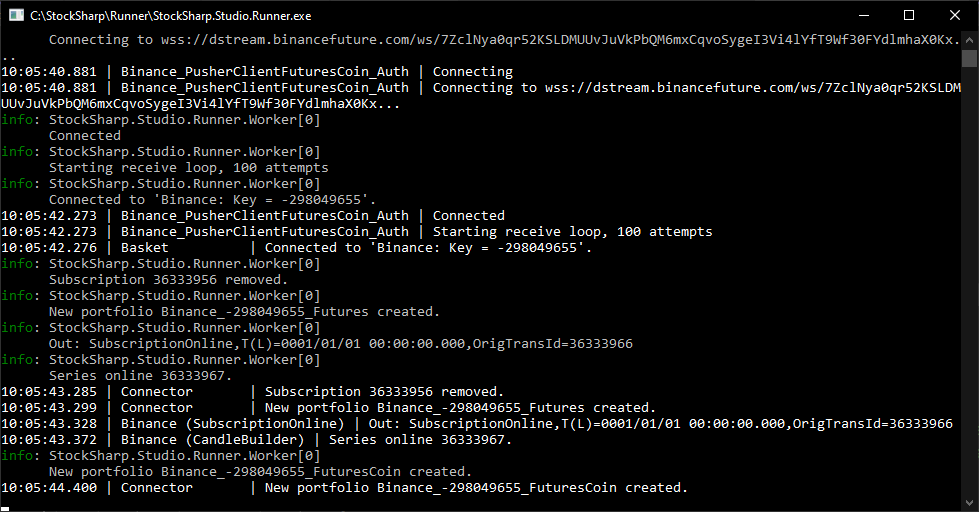
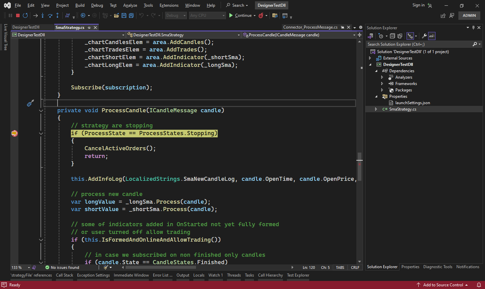

# Интеграция с Visual Studio

**Runner** можно использовать как средство для отладки стратегий по аналогии с [Designer](Designer_Debugging_DLL_using_Visual_Studio.md). Это удобно, если стратегия планируется запускаться только в **Runner**. В противном случае удобнее запускать и работать со стратегией внутри программы [Designer](Designer.md).

Для настройки процесса отладки необходимо проделать следующие шаги:

1. Нажать правой кнопкой на проект с торговой стратегией и выбрать в контекстном меню пункт **Properties**:



В появившейся закладке найти пункт **Debug** и выбрать раздел **General** и нажать **Open debug launch profiles UI**.

2. Далее, в открывшемся окне создать новый профиль отладки с запуском внешней программы:



3. Ввести параметры полного пути к **Runner**, а также указать в командной строке параметры для запуска. Подробнее, о [командной строке Runner](RunnerCommandLine.md).



Аргументы командной строки для примера:

```cmd
l -s "$(TargetPath)" -c "C:\StockSharp\Runner\Data\connection.json" --sec BTCUSDT_PERPETUAL@BNB --pf Binance_-298049655_Futures
```

$(TargetPath) - это специальный макрос **Visual Studio**, который при запуске отладки автозаменяется на путь к скомпилированной DLL со стратегией.

4. Закрыть окно с настройками проекта, и запустить отладку проекта (например, через F5). Появится окно с программой **Runner**, которое будет выводить на экран процесс подключения к торгам:



5. При установке точек прерывания, выполнение программы будет останавливаться при их достижении. Например, для отладки торговой логики при появлении новой свечи:

