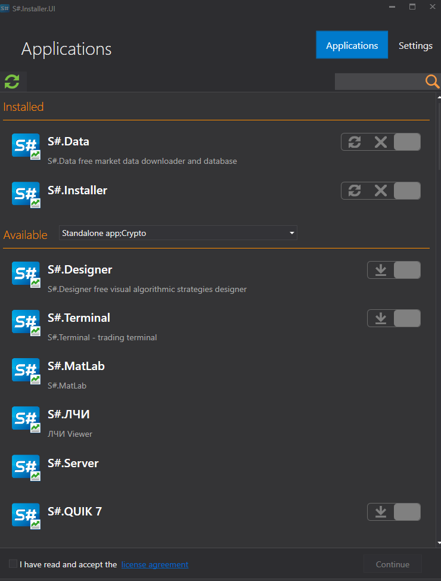

# Installer

**Installer** \- центр управления всеми программами и приложениями от **StockSharp**, позволяющее: 

- скачать и установить [Designer](Designer.md), [Terminal](Terminal.md), [Hydra](Hydra.md)
- установить плагин-коннекторы [QUIK](Quik.md) [MetaTrader](MT.md)
- купить и установить платные компоненты как [Shell](Shell.md), [MatLab](MatLab.md)
- купить и распаковать исходные коды таких программ как [Designer](Designer.md).
- устанавливать программы вместе с приобретенными коннекторами
- отслеживать процесс обновления программ
- скачать библиотеку [API](StockSharpAbout.md) и автоматически отслеживает ее обновления

## См. также

[Первый запуск](Installer_Installation.md)
