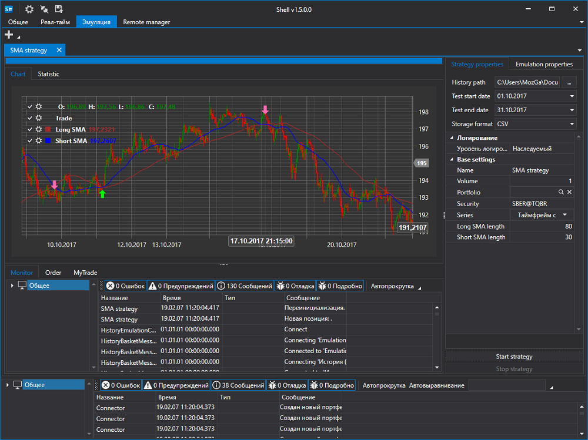

# Shell

**Shell** \- это готовый графический каркас с возможностью оперативного изменения под ваши нужды и с полностью открытым кодом на языке C\# (достаточно базовых знаний). 

Вам не нужно тратить время на создание GUI (графического интерфейса пользователя), готовый робот создается быстрее без ущерба для юзабилити приложения. Базовый функционал для тестирования, торговли, подключения к источникам данных, отображения графиков, портфелей, позиций, заявок и сделок уже в коробке.

Основные возможности оболочки торгового робота:

1. Полный исходный код. Идеально для роботов на заказ, или для своих решений.
2. **Поддержка более 70 подключений** к различным биржам мира [Коннекторы](api/connectors.md).
3. Гибкий пользовательский интерфейс.
4. Тестирование стратегий (статистика, эквити, отчет).
5. Сохранение и восстановление настроек стратегии.
6. Параллельный запуск стратегий.
7. Подробная информация о работе стратегии (ордера, сделки, позиция, прибыль, логи и т.д.). Все наглядно и просто.
8. Запуск стратегий по расписанию.

## См. также

[Установка Shell](shell/installing_shell.md)
