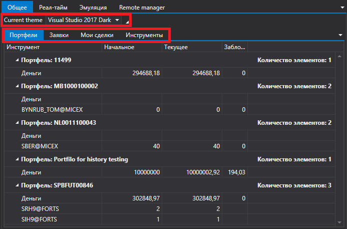
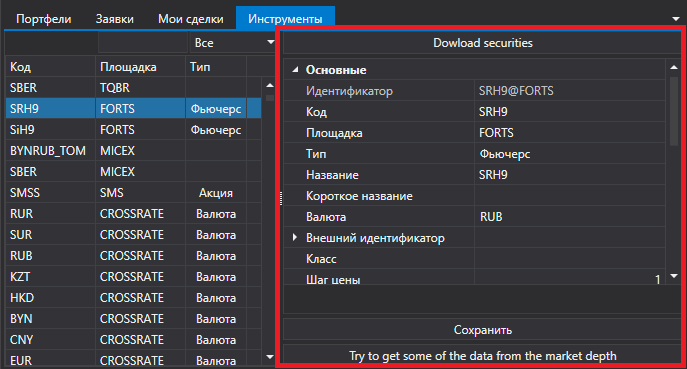

# Общее

Вкладка [Общее](Shell_Common.md) позволяет посмотреть общую информацию по портфелям, заявкам, сделкам, инструментам. Также здесь можно установить тему интефейса [S\#.Shell](Shell.md)

На вкладке **Инструменты** можно загрузить инструменты из локального хранилища, а также изменить параметры инструментов.

## См. также

[Реал\-тайм](Shell_RealTime.md)
