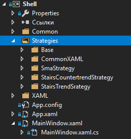
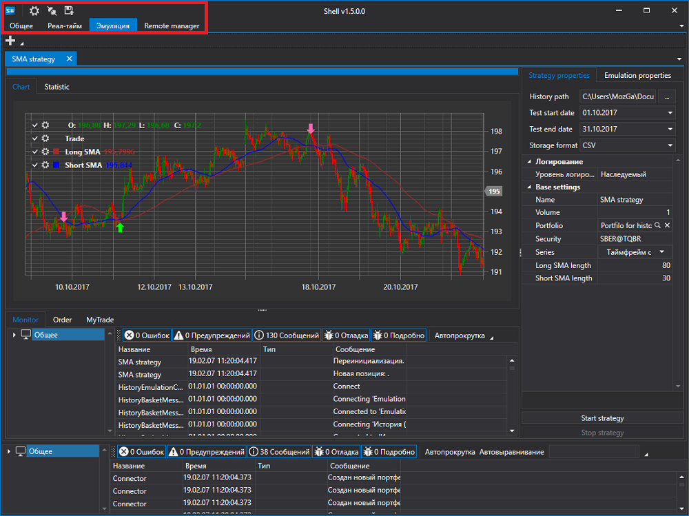
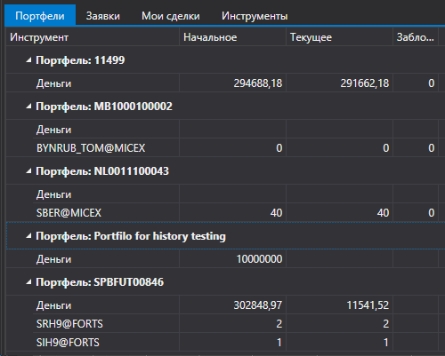
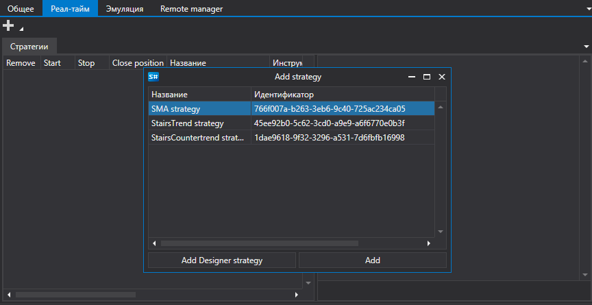
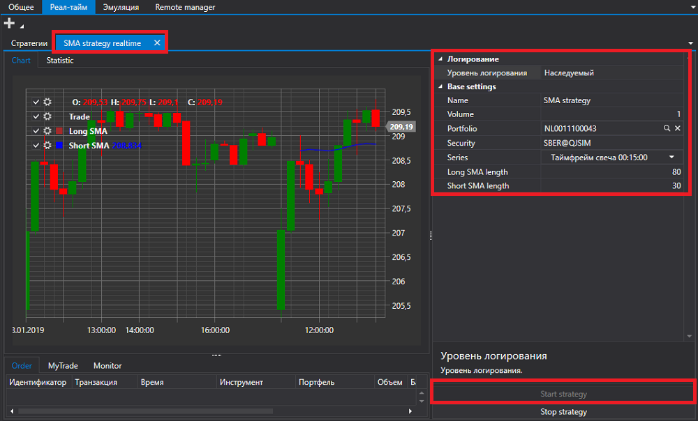
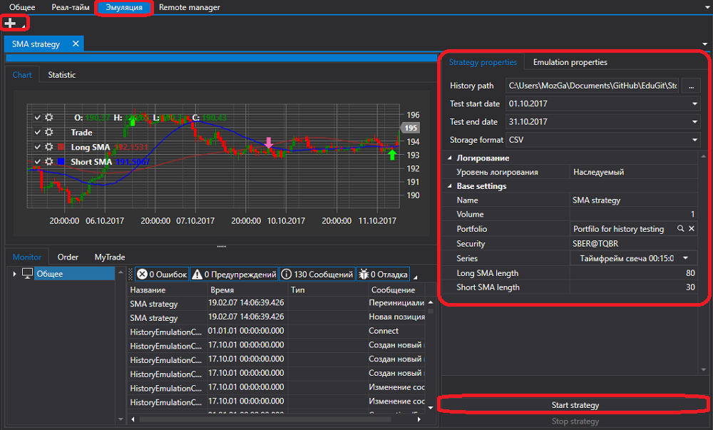

# Быстрый запуск

[S\#.Shell](Shell.md) \- ориентирована на программирование на языке [C\#](https://ru.wikipedia.org/wiki/C_Sharp) в среде Visual Studio или аналогичной.

При запуске проекта [S\#.Shell](Shell.md) в обозревателе решений будет отображен проект Shell:

Папка **Strategies** содержит три стратегии входящие в [S\#.Shell](Shell.md), оболочку для стратегий по умолчанию, а также некоторые вспомогательные интерфейсы.

Проект можно запускать без предварительной подготовки и посмотреть его работу на стратегиях, которые уже входят в [S\#.Shell](Shell.md).

После запуска мы увидим окно следующего вида

В верхней части экрана расположены кнопки настройки подключения, подключения и кнопка сохранения текущей конфигурации Shell. Там же расположены основные вкладки.

Перейдем в настройки подключения и выберем необходимое подключение. Как настроить подключение описано в пункте [Настройки подключения](Shell_Connection_settings.md).

Следующим шагом подключимся, нажав на кнопку **Подключиться**.

После подключения на вкладке [Общее](Shell_Common.md) можно посмотреть портфели, инстументы, заявки и собственные сделки, которые были получены из подключения.

Перейдя на вкладку Реал\-тайм нажав на кнопку **Добавить** добавим стратегию для запуска в торговлю.

После того как стратегия будет добавлена необходимо заполнить ее основные параметры такие как **Инструмент**, **Портфель** и др. Для запуска необходимо нажать на кнопку **Start strategy**.

Аналогично вкладке [Реал\-тайм](Shell_RealTime.md) на вкладке [Эмуляция](Shell_emulation.md) можно запустить тестирование стратегии на исторических данных

