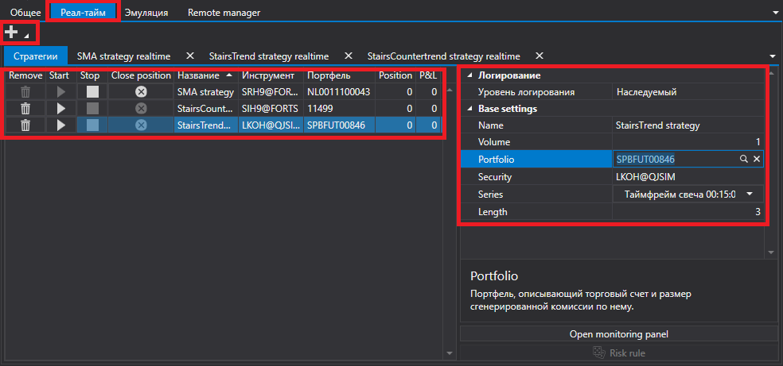

# Реал\-тайм

Вкладка [Реал\-тайм](Shell_RealTime.md) позволяет управлять стратегиями запущенными в торговлю.

Нажав на кнопку **Добавить** можно добавить стратегию для запуска в торговлю. Каждая добавленная стратегия открывается на отдельной вкладке, а также добавляется в список стратегий на вкладке **Стратегии**.

На вкладке **Стратегии** можно удалять, запускать, останавливать и настраивать стратегии. То же самое можно делать на индивидуальной вкладке стратегии. Индивидуальная вкладка стратегии имеет более обширную информацию по стратегии, статистику, список выставленных заявок и сделок стратегии и др.

## См. также

[Общее](Shell_Common.md)
